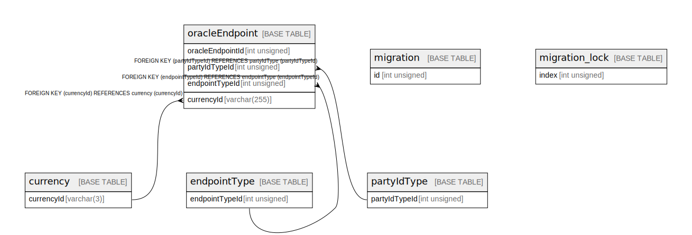

# account_lookup

## Tables

| Name                                | Columns | Comment | Type       |
| ----------------------------------- | ------- | ------- | ---------- |
| [currency](currency.md)             | 4       |         | BASE TABLE |
| [endpointType](endpointType.md)     | 5       |         | BASE TABLE |
| [migration](migration.md)           | 4       |         | BASE TABLE |
| [migration_lock](migration_lock.md) | 2       |         | BASE TABLE |
| [oracleEndpoint](oracleEndpoint.md) | 9       |         | BASE TABLE |
| [partyIdType](partyIdType.md)       | 5       |         | BASE TABLE |

## Relations

---

> Generated by [tbls](https://github.com/k1LoW/tbls)
