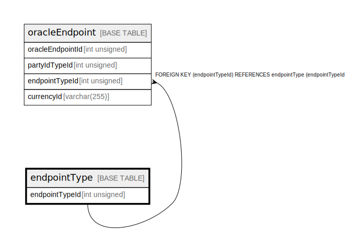

# endpointType

## Description

<details>
<summary><strong>Table Definition</strong></summary>

```sql
CREATE TABLE `endpointType` (
  `endpointTypeId` int unsigned NOT NULL AUTO_INCREMENT,
  `type` varchar(50) NOT NULL,
  `description` varchar(512) DEFAULT NULL,
  `isActive` tinyint(1) NOT NULL DEFAULT '1',
  `createdDate` datetime NOT NULL DEFAULT CURRENT_TIMESTAMP,
  PRIMARY KEY (`endpointTypeId`),
  UNIQUE KEY `endpointtype_type_unique` (`type`)
) ENGINE=InnoDB AUTO_INCREMENT=[Redacted by tbls] DEFAULT CHARSET=utf8mb4 COLLATE=utf8mb4_0900_ai_ci
```

</details>

## Columns

| Name           | Type         | Default           | Nullable | Extra Definition  | Children                            |
| -------------- | ------------ | ----------------- | -------- | ----------------- | ----------------------------------- |
| endpointTypeId | int unsigned |                   | false    | auto_increment    | [oracleEndpoint](oracleEndpoint.md) |
| type           | varchar(50)  |                   | false    |                   |                                     |
| description    | varchar(512) |                   | true     |                   |                                     |
| isActive       | tinyint(1)   | 1                 | false    |                   |                                     |
| createdDate    | datetime     | CURRENT_TIMESTAMP | false    | DEFAULT_GENERATED |                                     |

## Constraints

| Name                     | Type        | Definition                                 |
| ------------------------ | ----------- | ------------------------------------------ |
| endpointtype_type_unique | UNIQUE      | UNIQUE KEY endpointtype_type_unique (type) |
| PRIMARY                  | PRIMARY KEY | PRIMARY KEY (endpointTypeId)               |

## Indexes

| Name                     | Definition                                             |
| ------------------------ | ------------------------------------------------------ |
| PRIMARY                  | PRIMARY KEY (endpointTypeId) USING BTREE               |
| endpointtype_type_unique | UNIQUE KEY endpointtype_type_unique (type) USING BTREE |

## Relations



---

> Generated by [tbls](https://github.com/k1LoW/tbls)
