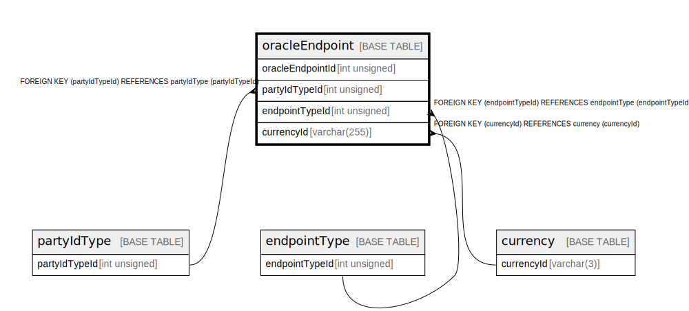

# oracleEndpoint

## Description

<details>
<summary><strong>Table Definition</strong></summary>

```sql
CREATE TABLE `oracleEndpoint` (
  `oracleEndpointId` int unsigned NOT NULL AUTO_INCREMENT,
  `partyIdTypeId` int unsigned NOT NULL,
  `endpointTypeId` int unsigned NOT NULL,
  `currencyId` varchar(255) DEFAULT NULL,
  `value` varchar(512) NOT NULL,
  `isDefault` tinyint(1) NOT NULL DEFAULT '0',
  `isActive` tinyint(1) NOT NULL DEFAULT '1',
  `createdDate` datetime NOT NULL DEFAULT CURRENT_TIMESTAMP,
  `createdBy` varchar(128) NOT NULL,
  PRIMARY KEY (`oracleEndpointId`),
  KEY `oracleendpoint_currencyid_foreign` (`currencyId`),
  KEY `oracleendpoint_partyidtypeid_index` (`partyIdTypeId`),
  KEY `oracleendpoint_endpointtypeid_index` (`endpointTypeId`),
  CONSTRAINT `oracleendpoint_currencyid_foreign` FOREIGN KEY (`currencyId`) REFERENCES `currency` (`currencyId`),
  CONSTRAINT `oracleendpoint_endpointtypeid_foreign` FOREIGN KEY (`endpointTypeId`) REFERENCES `endpointType` (`endpointTypeId`),
  CONSTRAINT `oracleendpoint_partyidtypeid_foreign` FOREIGN KEY (`partyIdTypeId`) REFERENCES `partyIdType` (`partyIdTypeId`)
) ENGINE=InnoDB DEFAULT CHARSET=utf8mb4 COLLATE=utf8mb4_0900_ai_ci
```

</details>

## Columns

| Name             | Type         | Default           | Nullable | Extra Definition  | Parents                         |
| ---------------- | ------------ | ----------------- | -------- | ----------------- | ------------------------------- |
| oracleEndpointId | int unsigned |                   | false    | auto_increment    |                                 |
| partyIdTypeId    | int unsigned |                   | false    |                   | [partyIdType](partyIdType.md)   |
| endpointTypeId   | int unsigned |                   | false    |                   | [endpointType](endpointType.md) |
| currencyId       | varchar(255) |                   | true     |                   | [currency](currency.md)         |
| value            | varchar(512) |                   | false    |                   |                                 |
| isDefault        | tinyint(1)   | 0                 | false    |                   |                                 |
| isActive         | tinyint(1)   | 1                 | false    |                   |                                 |
| createdDate      | datetime     | CURRENT_TIMESTAMP | false    | DEFAULT_GENERATED |                                 |
| createdBy        | varchar(128) |                   | false    |                   |                                 |

## Constraints

| Name                                  | Type        | Definition                                                            |
| ------------------------------------- | ----------- | --------------------------------------------------------------------- |
| oracleendpoint_currencyid_foreign     | FOREIGN KEY | FOREIGN KEY (currencyId) REFERENCES currency (currencyId)             |
| oracleendpoint_endpointtypeid_foreign | FOREIGN KEY | FOREIGN KEY (endpointTypeId) REFERENCES endpointType (endpointTypeId) |
| oracleendpoint_partyidtypeid_foreign  | FOREIGN KEY | FOREIGN KEY (partyIdTypeId) REFERENCES partyIdType (partyIdTypeId)    |
| PRIMARY                               | PRIMARY KEY | PRIMARY KEY (oracleEndpointId)                                        |

## Indexes

| Name                                | Definition                                                           |
| ----------------------------------- | -------------------------------------------------------------------- |
| oracleendpoint_currencyid_foreign   | KEY oracleendpoint_currencyid_foreign (currencyId) USING BTREE       |
| oracleendpoint_endpointtypeid_index | KEY oracleendpoint_endpointtypeid_index (endpointTypeId) USING BTREE |
| oracleendpoint_partyidtypeid_index  | KEY oracleendpoint_partyidtypeid_index (partyIdTypeId) USING BTREE   |
| PRIMARY                             | PRIMARY KEY (oracleEndpointId) USING BTREE                           |

## Relations



---

> Generated by [tbls](https://github.com/k1LoW/tbls)
