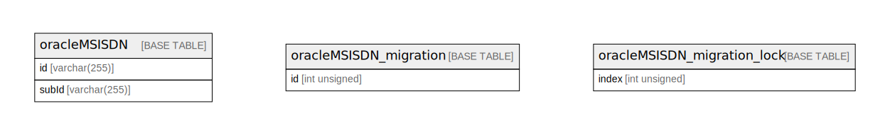

# als-msisdn-oracle

## Tables

| Name                                                          | Columns | Comment | Type       |
| ------------------------------------------------------------- | ------- | ------- | ---------- |
| [oracleMSISDN](oracleMSISDN.md)                               | 3       |         | BASE TABLE |
| [oracleMSISDN_migration](oracleMSISDN_migration.md)           | 4       |         | BASE TABLE |
| [oracleMSISDN_migration_lock](oracleMSISDN_migration_lock.md) | 2       |         | BASE TABLE |

## Relations

---

> Generated by [tbls](https://github.com/k1LoW/tbls)
