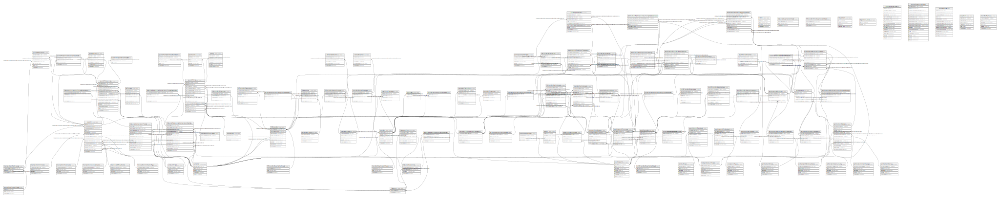

# central_ledger

## Tables

| Name                                                                                    | Columns | Comment                                                      | Type       |
| --------------------------------------------------------------------------------------- | ------- | ------------------------------------------------------------ | ---------- |
| [amountType](amountType.md)                                                             | 4       |                                                              | BASE TABLE |
| [balanceOfPayments](balanceOfPayments.md)                                               | 4       | See https://www.imf.org/external/np/sta/bopcode/guide.htm    | BASE TABLE |
| [bulkProcessingState](bulkProcessingState.md)                                           | 5       |                                                              | BASE TABLE |
| [bulkTransfer](bulkTransfer.md)                                                         | 6       |                                                              | BASE TABLE |
| [bulkTransferAssociation](bulkTransferAssociation.md)                                   | 8       |                                                              | BASE TABLE |
| [bulkTransferDuplicateCheck](bulkTransferDuplicateCheck.md)                             | 3       |                                                              | BASE TABLE |
| [bulkTransferError](bulkTransferError.md)                                               | 5       |                                                              | BASE TABLE |
| [bulkTransferExtension](bulkTransferExtension.md)                                       | 6       |                                                              | BASE TABLE |
| [bulkTransferFulfilment](bulkTransferFulfilment.md)                                     | 3       |                                                              | BASE TABLE |
| [bulkTransferFulfilmentDuplicateCheck](bulkTransferFulfilmentDuplicateCheck.md)         | 3       |                                                              | BASE TABLE |
| [bulkTransferState](bulkTransferState.md)                                               | 5       |                                                              | BASE TABLE |
| [bulkTransferStateChange](bulkTransferStateChange.md)                                   | 5       |                                                              | BASE TABLE |
| [contactType](contactType.md)                                                           | 5       |                                                              | BASE TABLE |
| [currency](currency.md)                                                                 | 5       |                                                              | BASE TABLE |
| [endpointType](endpointType.md)                                                         | 5       |                                                              | BASE TABLE |
| [event](event.md)                                                                       | 4       |                                                              | BASE TABLE |
| [expiringTransfer](expiringTransfer.md)                                                 | 4       |                                                              | BASE TABLE |
| [externalParticipant](externalParticipant.md)                                           | 4       |                                                              | BASE TABLE |
| [fxCharge](fxCharge.md)                                                                 | 7       |                                                              | BASE TABLE |
| [fxParticipantCurrencyType](fxParticipantCurrencyType.md)                               | 4       |                                                              | BASE TABLE |
| [fxQuote](fxQuote.md)                                                                   | 2       |                                                              | BASE TABLE |
| [fxQuoteConversionTerms](fxQuoteConversionTerms.md)                                     | 12      |                                                              | BASE TABLE |
| [fxQuoteConversionTermsExtension](fxQuoteConversionTermsExtension.md)                   | 5       |                                                              | BASE TABLE |
| [fxQuoteDuplicateCheck](fxQuoteDuplicateCheck.md)                                       | 3       |                                                              | BASE TABLE |
| [fxQuoteError](fxQuoteError.md)                                                         | 6       |                                                              | BASE TABLE |
| [fxQuoteResponse](fxQuoteResponse.md)                                                   | 4       |                                                              | BASE TABLE |
| [fxQuoteResponseConversionTerms](fxQuoteResponseConversionTerms.md)                     | 13      |                                                              | BASE TABLE |
| [fxQuoteResponseConversionTermsExtension](fxQuoteResponseConversionTermsExtension.md)   | 5       |                                                              | BASE TABLE |
| [fxQuoteResponseDuplicateCheck](fxQuoteResponseDuplicateCheck.md)                       | 4       |                                                              | BASE TABLE |
| [fxTransfer](fxTransfer.md)                                                             | 9       |                                                              | BASE TABLE |
| [fxTransferDuplicateCheck](fxTransferDuplicateCheck.md)                                 | 3       |                                                              | BASE TABLE |
| [fxTransferError](fxTransferError.md)                                                   | 5       |                                                              | BASE TABLE |
| [fxTransferErrorDuplicateCheck](fxTransferErrorDuplicateCheck.md)                       | 3       |                                                              | BASE TABLE |
| [fxTransferExtension](fxTransferExtension.md)                                           | 7       |                                                              | BASE TABLE |
| [fxTransferFulfilment](fxTransferFulfilment.md)                                         | 6       |                                                              | BASE TABLE |
| [fxTransferFulfilmentDuplicateCheck](fxTransferFulfilmentDuplicateCheck.md)             | 3       |                                                              | BASE TABLE |
| [fxTransferParticipant](fxTransferParticipant.md)                                       | 10      |                                                              | BASE TABLE |
| [fxTransferStateChange](fxTransferStateChange.md)                                       | 5       |                                                              | BASE TABLE |
| [fxTransferTimeout](fxTransferTimeout.md)                                               | 4       |                                                              | BASE TABLE |
| [fxTransferType](fxTransferType.md)                                                     | 4       |                                                              | BASE TABLE |
| [fxWatchList](fxWatchList.md)                                                           | 5       |                                                              | BASE TABLE |
| [geoCode](geoCode.md)                                                                   | 5       |                                                              | BASE TABLE |
| [ilpPacket](ilpPacket.md)                                                               | 3       |                                                              | BASE TABLE |
| [ledgerAccountType](ledgerAccountType.md)                                               | 6       |                                                              | BASE TABLE |
| [ledgerEntryType](ledgerEntryType.md)                                                   | 6       |                                                              | BASE TABLE |
| [migration](migration.md)                                                               | 4       |                                                              | BASE TABLE |
| [migration_lock](migration_lock.md)                                                     | 2       |                                                              | BASE TABLE |
| [participant](participant.md)                                                           | 7       |                                                              | BASE TABLE |
| [participantContact](participantContact.md)                                             | 8       |                                                              | BASE TABLE |
| [participantCurrency](participantCurrency.md)                                           | 7       |                                                              | BASE TABLE |
| [participantEndpoint](participantEndpoint.md)                                           | 7       |                                                              | BASE TABLE |
| [participantLimit](participantLimit.md)                                                 | 9       |                                                              | BASE TABLE |
| [participantLimitType](participantLimitType.md)                                         | 5       |                                                              | BASE TABLE |
| [participantParty](participantParty.md)                                                 | 3       |                                                              | BASE TABLE |
| [participantPosition](participantPosition.md)                                           | 5       |                                                              | BASE TABLE |
| [participantPositionChange](participantPositionChange.md)                               | 9       |                                                              | BASE TABLE |
| [party](party.md)                                                                       | 6       | Optional pers. data provided during Quote Request & Response | BASE TABLE |
| [partyIdentifierType](partyIdentifierType.md)                                           | 3       |                                                              | BASE TABLE |
| [partyType](partyType.md)                                                               | 3       |                                                              | BASE TABLE |
| [quote](quote.md)                                                                       | 14      |                                                              | BASE TABLE |
| [quoteDuplicateCheck](quoteDuplicateCheck.md)                                           | 3       |                                                              | BASE TABLE |
| [quoteError](quoteError.md)                                                             | 6       |                                                              | BASE TABLE |
| [quoteExtension](quoteExtension.md)                                                     | 7       |                                                              | BASE TABLE |
| [quoteParty](quoteParty.md)                                                             | 15      |                                                              | BASE TABLE |
| [quotePartyIdInfoExtension](quotePartyIdInfoExtension.md)                               | 5       |                                                              | BASE TABLE |
| [quotePartyView](quotePartyView.md)                                                     | 15      | VIEW                                                         | VIEW       |
| [quoteResponse](quoteResponse.md)                                                       | 14      | This table is the primary store for quote responses          | BASE TABLE |
| [quoteResponseDuplicateCheck](quoteResponseDuplicateCheck.md)                           | 4       |                                                              | BASE TABLE |
| [quoteResponseIlpPacket](quoteResponseIlpPacket.md)                                     | 2       |                                                              | BASE TABLE |
| [quoteResponseView](quoteResponseView.md)                                               | 17      | VIEW                                                         | VIEW       |
| [quoteView](quoteView.md)                                                               | 13      | VIEW                                                         | VIEW       |
| [segment](segment.md)                                                                   | 6       |                                                              | BASE TABLE |
| [settlement](settlement.md)                                                             | 5       |                                                              | BASE TABLE |
| [settlementContentAggregation](settlementContentAggregation.md)                         | 9       |                                                              | BASE TABLE |
| [settlementDelay](settlementDelay.md)                                                   | 5       |                                                              | BASE TABLE |
| [settlementGranularity](settlementGranularity.md)                                       | 5       |                                                              | BASE TABLE |
| [settlementInterchange](settlementInterchange.md)                                       | 5       |                                                              | BASE TABLE |
| [settlementModel](settlementModel.md)                                                   | 12      |                                                              | BASE TABLE |
| [settlementParticipantCurrency](settlementParticipantCurrency.md)                       | 7       |                                                              | BASE TABLE |
| [settlementParticipantCurrencyStateChange](settlementParticipantCurrencyStateChange.md) | 6       |                                                              | BASE TABLE |
| [settlementSettlementWindow](settlementSettlementWindow.md)                             | 4       |                                                              | BASE TABLE |
| [settlementState](settlementState.md)                                                   | 5       |                                                              | BASE TABLE |
| [settlementStateChange](settlementStateChange.md)                                       | 5       |                                                              | BASE TABLE |
| [settlementTransferParticipant](settlementTransferParticipant.md)                       | 8       |                                                              | BASE TABLE |
| [settlementWindow](settlementWindow.md)                                                 | 4       |                                                              | BASE TABLE |
| [settlementWindowContent](settlementWindowContent.md)                                   | 8       |                                                              | BASE TABLE |
| [settlementWindowContentStateChange](settlementWindowContentStateChange.md)             | 5       |                                                              | BASE TABLE |
| [settlementWindowState](settlementWindowState.md)                                       | 5       |                                                              | BASE TABLE |
| [settlementWindowStateChange](settlementWindowStateChange.md)                           | 5       |                                                              | BASE TABLE |
| [token](token.md)                                                                       | 5       |                                                              | BASE TABLE |
| [transactionInitiator](transactionInitiator.md)                                         | 4       |                                                              | BASE TABLE |
| [transactionInitiatorType](transactionInitiatorType.md)                                 | 4       |                                                              | BASE TABLE |
| [transactionReference](transactionReference.md)                                         | 3       |                                                              | BASE TABLE |
| [transactionScenario](transactionScenario.md)                                           | 4       |                                                              | BASE TABLE |
| [transactionSubScenario](transactionSubScenario.md)                                     | 4       |                                                              | BASE TABLE |
| [transfer](transfer.md)                                                                 | 6       |                                                              | BASE TABLE |
| [transferDuplicateCheck](transferDuplicateCheck.md)                                     | 3       |                                                              | BASE TABLE |
| [transferError](transferError.md)                                                       | 5       |                                                              | BASE TABLE |
| [transferErrorDuplicateCheck](transferErrorDuplicateCheck.md)                           | 3       |                                                              | BASE TABLE |
| [transferExtension](transferExtension.md)                                               | 7       |                                                              | BASE TABLE |
| [transferFulfilment](transferFulfilment.md)                                             | 6       |                                                              | BASE TABLE |
| [transferFulfilmentDuplicateCheck](transferFulfilmentDuplicateCheck.md)                 | 3       |                                                              | BASE TABLE |
| [transferParticipant](transferParticipant.md)                                           | 9       |                                                              | BASE TABLE |
| [transferParticipantRoleType](transferParticipantRoleType.md)                           | 5       |                                                              | BASE TABLE |
| [transferRules](transferRules.md)                                                       | 6       |                                                              | BASE TABLE |
| [transferState](transferState.md)                                                       | 5       |                                                              | BASE TABLE |
| [transferStateChange](transferStateChange.md)                                           | 5       |                                                              | BASE TABLE |
| [transferTimeout](transferTimeout.md)                                                   | 4       |                                                              | BASE TABLE |

## Relations

---

> Generated by [tbls](https://github.com/k1LoW/tbls)
