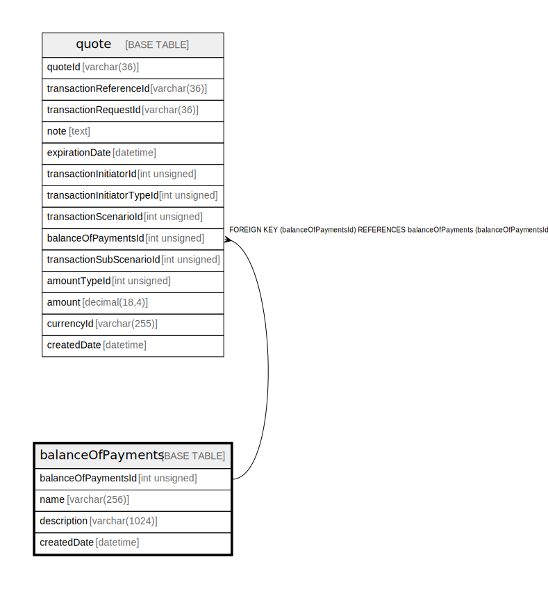

# balanceOfPayments

## Description

See https://www.imf.org/external/np/sta/bopcode/guide.htm

<details>
<summary><strong>Table Definition</strong></summary>

```sql
CREATE TABLE `balanceOfPayments` (
  `balanceOfPaymentsId` int unsigned NOT NULL,
  `name` varchar(256) NOT NULL,
  `description` varchar(1024) DEFAULT NULL COMMENT 'Possible values and meaning are defined in https://www.imf.org/external/np/sta/bopcode/',
  `createdDate` datetime NOT NULL DEFAULT CURRENT_TIMESTAMP COMMENT 'System dateTime stamp pertaining to the inserted record',
  PRIMARY KEY (`balanceOfPaymentsId`),
  UNIQUE KEY `balanceofpayments_name_unique` (`name`)
) ENGINE=InnoDB DEFAULT CHARSET=utf8mb4 COLLATE=utf8mb4_0900_ai_ci COMMENT='See https://www.imf.org/external/np/sta/bopcode/guide.htm'
```

</details>

## Columns

| Name | Type | Default | Nullable | Extra Definition | Children | Parents | Comment |
| ---- | ---- | ------- | -------- | ---------------- | -------- | ------- | ------- |
| balanceOfPaymentsId | int unsigned |  | false |  | [quote](quote.md) |  |  |
| name | varchar(256) |  | false |  |  |  |  |
| description | varchar(1024) |  | true |  |  |  | Possible values and meaning are defined in https://www.imf.org/external/np/sta/bopcode/ |
| createdDate | datetime | CURRENT_TIMESTAMP | false | DEFAULT_GENERATED |  |  | System dateTime stamp pertaining to the inserted record |

## Constraints

| Name | Type | Definition |
| ---- | ---- | ---------- |
| balanceofpayments_name_unique | UNIQUE | UNIQUE KEY balanceofpayments_name_unique (name) |
| PRIMARY | PRIMARY KEY | PRIMARY KEY (balanceOfPaymentsId) |

## Indexes

| Name | Definition |
| ---- | ---------- |
| PRIMARY | PRIMARY KEY (balanceOfPaymentsId) USING BTREE |
| balanceofpayments_name_unique | UNIQUE KEY balanceofpayments_name_unique (name) USING BTREE |

## Relations



---

> Generated by [tbls](https://github.com/k1LoW/tbls)
