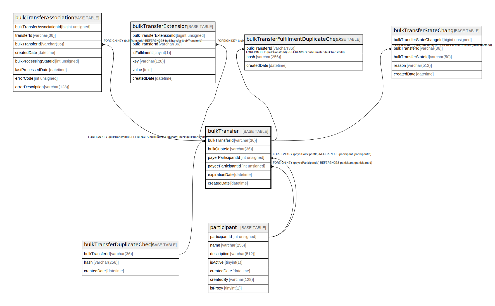

# bulkTransfer

## Description

<details>
<summary><strong>Table Definition</strong></summary>

```sql
CREATE TABLE `bulkTransfer` (
  `bulkTransferId` varchar(36) NOT NULL,
  `bulkQuoteId` varchar(36) DEFAULT NULL,
  `payerParticipantId` int unsigned DEFAULT NULL,
  `payeeParticipantId` int unsigned DEFAULT NULL,
  `expirationDate` datetime NOT NULL,
  `createdDate` datetime NOT NULL DEFAULT CURRENT_TIMESTAMP,
  PRIMARY KEY (`bulkTransferId`),
  KEY `bulktransfer_payerparticipantid_index` (`payerParticipantId`),
  KEY `bulktransfer_payeeparticipantid_index` (`payeeParticipantId`),
  CONSTRAINT `bulktransfer_bulktransferid_foreign` FOREIGN KEY (`bulkTransferId`) REFERENCES `bulkTransferDuplicateCheck` (`bulkTransferId`),
  CONSTRAINT `bulktransfer_payeeparticipantid_foreign` FOREIGN KEY (`payeeParticipantId`) REFERENCES `participant` (`participantId`),
  CONSTRAINT `bulktransfer_payerparticipantid_foreign` FOREIGN KEY (`payerParticipantId`) REFERENCES `participant` (`participantId`)
) ENGINE=InnoDB DEFAULT CHARSET=utf8mb4 COLLATE=utf8mb4_0900_ai_ci
```

</details>

## Columns

| Name | Type | Default | Nullable | Extra Definition | Children | Parents | Comment |
| ---- | ---- | ------- | -------- | ---------------- | -------- | ------- | ------- |
| bulkTransferId | varchar(36) |  | false |  | [bulkTransferAssociation](bulkTransferAssociation.md) [bulkTransferExtension](bulkTransferExtension.md) [bulkTransferFulfilmentDuplicateCheck](bulkTransferFulfilmentDuplicateCheck.md) [bulkTransferStateChange](bulkTransferStateChange.md) | [bulkTransferDuplicateCheck](bulkTransferDuplicateCheck.md) |  |
| bulkQuoteId | varchar(36) |  | true |  |  |  |  |
| payerParticipantId | int unsigned |  | true |  |  | [participant](participant.md) |  |
| payeeParticipantId | int unsigned |  | true |  |  | [participant](participant.md) |  |
| expirationDate | datetime |  | false |  |  |  |  |
| createdDate | datetime | CURRENT_TIMESTAMP | false | DEFAULT_GENERATED |  |  |  |

## Constraints

| Name | Type | Definition |
| ---- | ---- | ---------- |
| bulktransfer_bulktransferid_foreign | FOREIGN KEY | FOREIGN KEY (bulkTransferId) REFERENCES bulkTransferDuplicateCheck (bulkTransferId) |
| bulktransfer_payeeparticipantid_foreign | FOREIGN KEY | FOREIGN KEY (payeeParticipantId) REFERENCES participant (participantId) |
| bulktransfer_payerparticipantid_foreign | FOREIGN KEY | FOREIGN KEY (payerParticipantId) REFERENCES participant (participantId) |
| PRIMARY | PRIMARY KEY | PRIMARY KEY (bulkTransferId) |

## Indexes

| Name | Definition |
| ---- | ---------- |
| bulktransfer_payeeparticipantid_index | KEY bulktransfer_payeeparticipantid_index (payeeParticipantId) USING BTREE |
| bulktransfer_payerparticipantid_index | KEY bulktransfer_payerparticipantid_index (payerParticipantId) USING BTREE |
| PRIMARY | PRIMARY KEY (bulkTransferId) USING BTREE |

## Relations



---

> Generated by [tbls](https://github.com/k1LoW/tbls)
