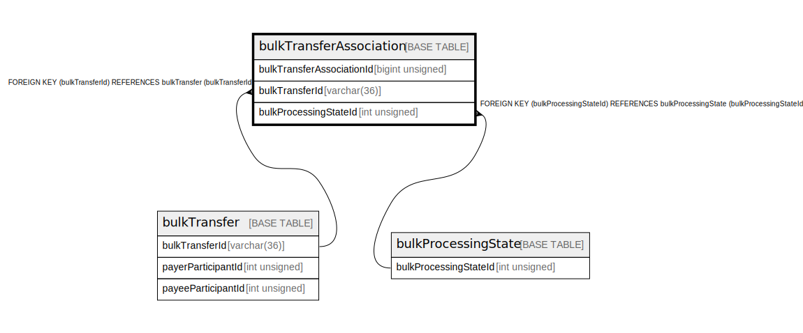

# bulkTransferAssociation

## Description

<details>
<summary><strong>Table Definition</strong></summary>

```sql
CREATE TABLE `bulkTransferAssociation` (
  `bulkTransferAssociationId` bigint unsigned NOT NULL AUTO_INCREMENT,
  `transferId` varchar(36) NOT NULL,
  `bulkTransferId` varchar(36) NOT NULL,
  `createdDate` datetime NOT NULL DEFAULT CURRENT_TIMESTAMP,
  `bulkProcessingStateId` int unsigned NOT NULL,
  `lastProcessedDate` datetime NOT NULL DEFAULT CURRENT_TIMESTAMP,
  `errorCode` int unsigned DEFAULT NULL,
  `errorDescription` varchar(128) DEFAULT NULL,
  PRIMARY KEY (`bulkTransferAssociationId`),
  UNIQUE KEY `bulktransferassociation_transferid_bulktransferid_unique` (`transferId`,`bulkTransferId`),
  KEY `bulktransferassociation_bulktransferid_foreign` (`bulkTransferId`),
  KEY `bulktransferassociation_bulkprocessingstateid_foreign` (`bulkProcessingStateId`),
  CONSTRAINT `bulktransferassociation_bulkprocessingstateid_foreign` FOREIGN KEY (`bulkProcessingStateId`) REFERENCES `bulkProcessingState` (`bulkProcessingStateId`),
  CONSTRAINT `bulktransferassociation_bulktransferid_foreign` FOREIGN KEY (`bulkTransferId`) REFERENCES `bulkTransfer` (`bulkTransferId`)
) ENGINE=InnoDB DEFAULT CHARSET=utf8mb4 COLLATE=utf8mb4_0900_ai_ci
```

</details>

## Columns

| Name | Type | Default | Nullable | Extra Definition | Children | Parents | Comment |
| ---- | ---- | ------- | -------- | ---------------- | -------- | ------- | ------- |
| bulkTransferAssociationId | bigint unsigned |  | false | auto_increment |  |  |  |
| transferId | varchar(36) |  | false |  |  |  |  |
| bulkTransferId | varchar(36) |  | false |  |  | [bulkTransfer](bulkTransfer.md) |  |
| createdDate | datetime | CURRENT_TIMESTAMP | false | DEFAULT_GENERATED |  |  |  |
| bulkProcessingStateId | int unsigned |  | false |  |  | [bulkProcessingState](bulkProcessingState.md) |  |
| lastProcessedDate | datetime | CURRENT_TIMESTAMP | false | DEFAULT_GENERATED |  |  |  |
| errorCode | int unsigned |  | true |  |  |  |  |
| errorDescription | varchar(128) |  | true |  |  |  |  |

## Constraints

| Name | Type | Definition |
| ---- | ---- | ---------- |
| bulktransferassociation_bulkprocessingstateid_foreign | FOREIGN KEY | FOREIGN KEY (bulkProcessingStateId) REFERENCES bulkProcessingState (bulkProcessingStateId) |
| bulktransferassociation_bulktransferid_foreign | FOREIGN KEY | FOREIGN KEY (bulkTransferId) REFERENCES bulkTransfer (bulkTransferId) |
| bulktransferassociation_transferid_bulktransferid_unique | UNIQUE | UNIQUE KEY bulktransferassociation_transferid_bulktransferid_unique (transferId, bulkTransferId) |
| PRIMARY | PRIMARY KEY | PRIMARY KEY (bulkTransferAssociationId) |

## Indexes

| Name | Definition |
| ---- | ---------- |
| bulktransferassociation_bulkprocessingstateid_foreign | KEY bulktransferassociation_bulkprocessingstateid_foreign (bulkProcessingStateId) USING BTREE |
| bulktransferassociation_bulktransferid_foreign | KEY bulktransferassociation_bulktransferid_foreign (bulkTransferId) USING BTREE |
| PRIMARY | PRIMARY KEY (bulkTransferAssociationId) USING BTREE |
| bulktransferassociation_transferid_bulktransferid_unique | UNIQUE KEY bulktransferassociation_transferid_bulktransferid_unique (transferId, bulkTransferId) USING BTREE |

## Relations



---

> Generated by [tbls](https://github.com/k1LoW/tbls)
