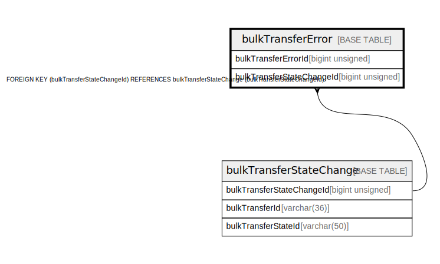

# bulkTransferError

## Description

<details>
<summary><strong>Table Definition</strong></summary>

```sql
CREATE TABLE `bulkTransferError` (
  `bulkTransferErrorId` bigint unsigned NOT NULL AUTO_INCREMENT,
  `bulkTransferStateChangeId` bigint unsigned NOT NULL,
  `errorCode` int unsigned NOT NULL,
  `errorDescription` varchar(128) NOT NULL,
  `createdDate` datetime NOT NULL DEFAULT CURRENT_TIMESTAMP,
  PRIMARY KEY (`bulkTransferErrorId`),
  KEY `bulktransfererror_bulktransferstatechangeid_index` (`bulkTransferStateChangeId`),
  CONSTRAINT `bulktransfererror_bulktransferstatechangeid_foreign` FOREIGN KEY (`bulkTransferStateChangeId`) REFERENCES `bulkTransferStateChange` (`bulkTransferStateChangeId`)
) ENGINE=InnoDB DEFAULT CHARSET=utf8mb4 COLLATE=utf8mb4_0900_ai_ci
```

</details>

## Columns

| Name                      | Type            | Default           | Nullable | Extra Definition  | Parents                                               |
| ------------------------- | --------------- | ----------------- | -------- | ----------------- | ----------------------------------------------------- |
| bulkTransferErrorId       | bigint unsigned |                   | false    | auto_increment    |                                                       |
| bulkTransferStateChangeId | bigint unsigned |                   | false    |                   | [bulkTransferStateChange](bulkTransferStateChange.md) |
| errorCode                 | int unsigned    |                   | false    |                   |                                                       |
| errorDescription          | varchar(128)    |                   | false    |                   |                                                       |
| createdDate               | datetime        | CURRENT_TIMESTAMP | false    | DEFAULT_GENERATED |                                                       |

## Constraints

| Name                                                | Type        | Definition                                                                                             |
| --------------------------------------------------- | ----------- | ------------------------------------------------------------------------------------------------------ |
| bulktransfererror_bulktransferstatechangeid_foreign | FOREIGN KEY | FOREIGN KEY (bulkTransferStateChangeId) REFERENCES bulkTransferStateChange (bulkTransferStateChangeId) |
| PRIMARY                                             | PRIMARY KEY | PRIMARY KEY (bulkTransferErrorId)                                                                      |

## Indexes

| Name                                              | Definition                                                                                    |
| ------------------------------------------------- | --------------------------------------------------------------------------------------------- |
| bulktransfererror_bulktransferstatechangeid_index | KEY bulktransfererror_bulktransferstatechangeid_index (bulkTransferStateChangeId) USING BTREE |
| PRIMARY                                           | PRIMARY KEY (bulkTransferErrorId) USING BTREE                                                 |

## Relations



---

> Generated by [tbls](https://github.com/k1LoW/tbls)
