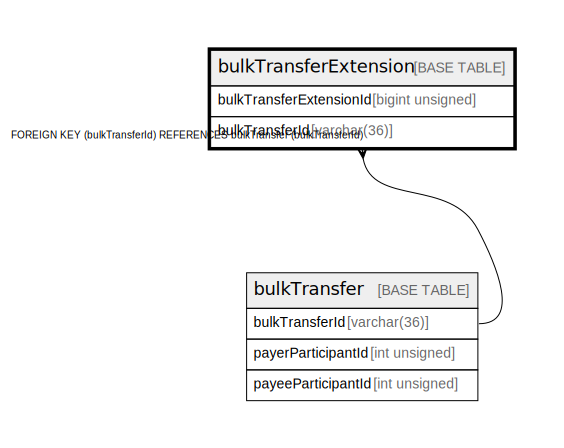

# bulkTransferExtension

## Description

<details>
<summary><strong>Table Definition</strong></summary>

```sql
CREATE TABLE `bulkTransferExtension` (
  `bulkTransferExtensionId` bigint unsigned NOT NULL AUTO_INCREMENT,
  `bulkTransferId` varchar(36) NOT NULL,
  `isFulfilment` tinyint(1) NOT NULL DEFAULT '0',
  `key` varchar(128) NOT NULL,
  `value` text NOT NULL,
  `createdDate` datetime NOT NULL DEFAULT CURRENT_TIMESTAMP,
  PRIMARY KEY (`bulkTransferExtensionId`),
  KEY `bulktransferextension_bulktransferid_index` (`bulkTransferId`),
  CONSTRAINT `bulktransferextension_bulktransferid_foreign` FOREIGN KEY (`bulkTransferId`) REFERENCES `bulkTransfer` (`bulkTransferId`)
) ENGINE=InnoDB DEFAULT CHARSET=utf8mb4 COLLATE=utf8mb4_0900_ai_ci
```

</details>

## Columns

| Name                    | Type            | Default           | Nullable | Extra Definition  | Parents                         |
| ----------------------- | --------------- | ----------------- | -------- | ----------------- | ------------------------------- |
| bulkTransferExtensionId | bigint unsigned |                   | false    | auto_increment    |                                 |
| bulkTransferId          | varchar(36)     |                   | false    |                   | [bulkTransfer](bulkTransfer.md) |
| isFulfilment            | tinyint(1)      | 0                 | false    |                   |                                 |
| key                     | varchar(128)    |                   | false    |                   |                                 |
| value                   | text            |                   | false    |                   |                                 |
| createdDate             | datetime        | CURRENT_TIMESTAMP | false    | DEFAULT_GENERATED |                                 |

## Constraints

| Name                                         | Type        | Definition                                                            |
| -------------------------------------------- | ----------- | --------------------------------------------------------------------- |
| bulktransferextension_bulktransferid_foreign | FOREIGN KEY | FOREIGN KEY (bulkTransferId) REFERENCES bulkTransfer (bulkTransferId) |
| PRIMARY                                      | PRIMARY KEY | PRIMARY KEY (bulkTransferExtensionId)                                 |

## Indexes

| Name                                       | Definition                                                                  |
| ------------------------------------------ | --------------------------------------------------------------------------- |
| bulktransferextension_bulktransferid_index | KEY bulktransferextension_bulktransferid_index (bulkTransferId) USING BTREE |
| PRIMARY                                    | PRIMARY KEY (bulkTransferExtensionId) USING BTREE                           |

## Relations



---

> Generated by [tbls](https://github.com/k1LoW/tbls)
