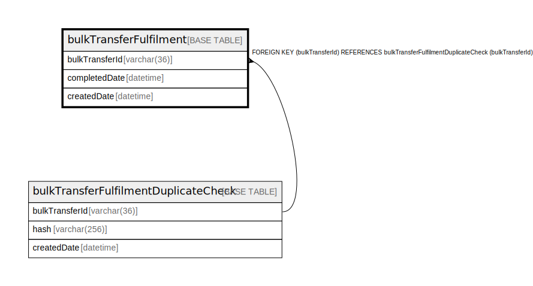

# bulkTransferFulfilment

## Description

<details>
<summary><strong>Table Definition</strong></summary>

```sql
CREATE TABLE `bulkTransferFulfilment` (
  `bulkTransferId` varchar(36) NOT NULL,
  `completedDate` datetime NOT NULL,
  `createdDate` datetime NOT NULL DEFAULT CURRENT_TIMESTAMP,
  PRIMARY KEY (`bulkTransferId`),
  CONSTRAINT `bulktransferfulfilment_bulktransferid_foreign` FOREIGN KEY (`bulkTransferId`) REFERENCES `bulkTransferFulfilmentDuplicateCheck` (`bulkTransferId`)
) ENGINE=InnoDB DEFAULT CHARSET=utf8mb4 COLLATE=utf8mb4_0900_ai_ci
```

</details>

## Columns

| Name | Type | Default | Nullable | Extra Definition | Children | Parents | Comment |
| ---- | ---- | ------- | -------- | ---------------- | -------- | ------- | ------- |
| bulkTransferId | varchar(36) |  | false |  |  | [bulkTransferFulfilmentDuplicateCheck](bulkTransferFulfilmentDuplicateCheck.md) |  |
| completedDate | datetime |  | false |  |  |  |  |
| createdDate | datetime | CURRENT_TIMESTAMP | false | DEFAULT_GENERATED |  |  |  |

## Constraints

| Name | Type | Definition |
| ---- | ---- | ---------- |
| bulktransferfulfilment_bulktransferid_foreign | FOREIGN KEY | FOREIGN KEY (bulkTransferId) REFERENCES bulkTransferFulfilmentDuplicateCheck (bulkTransferId) |
| PRIMARY | PRIMARY KEY | PRIMARY KEY (bulkTransferId) |

## Indexes

| Name | Definition |
| ---- | ---------- |
| PRIMARY | PRIMARY KEY (bulkTransferId) USING BTREE |

## Relations



---

> Generated by [tbls](https://github.com/k1LoW/tbls)
