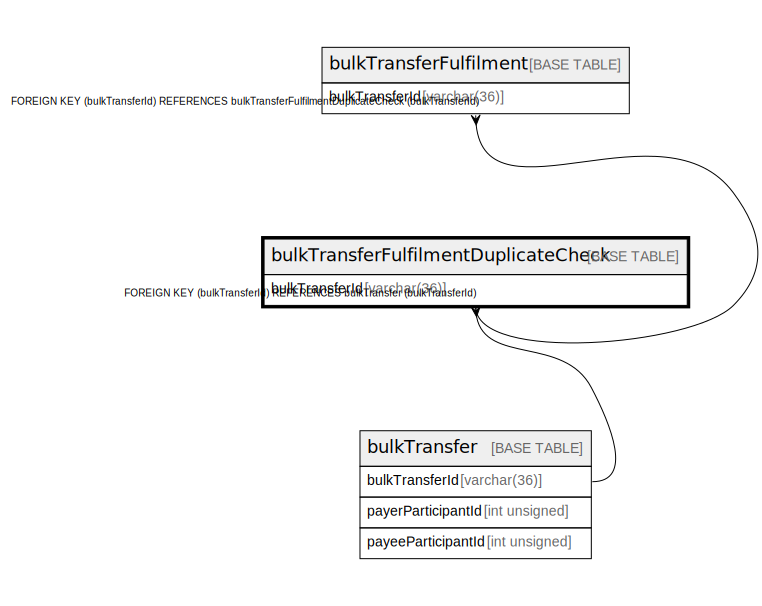

# bulkTransferFulfilmentDuplicateCheck

## Description

<details>
<summary><strong>Table Definition</strong></summary>

```sql
CREATE TABLE `bulkTransferFulfilmentDuplicateCheck` (
  `bulkTransferId` varchar(36) NOT NULL,
  `hash` varchar(256) NOT NULL,
  `createdDate` datetime NOT NULL DEFAULT CURRENT_TIMESTAMP,
  PRIMARY KEY (`bulkTransferId`),
  CONSTRAINT `bulktransferfulfilmentduplicatecheck_bulktransferid_foreign` FOREIGN KEY (`bulkTransferId`) REFERENCES `bulkTransfer` (`bulkTransferId`)
) ENGINE=InnoDB DEFAULT CHARSET=utf8mb4 COLLATE=utf8mb4_0900_ai_ci
```

</details>

## Columns

| Name           | Type         | Default           | Nullable | Extra Definition  | Children                                            | Parents                         |
| -------------- | ------------ | ----------------- | -------- | ----------------- | --------------------------------------------------- | ------------------------------- |
| bulkTransferId | varchar(36)  |                   | false    |                   | [bulkTransferFulfilment](bulkTransferFulfilment.md) | [bulkTransfer](bulkTransfer.md) |
| hash           | varchar(256) |                   | false    |                   |                                                     |                                 |
| createdDate    | datetime     | CURRENT_TIMESTAMP | false    | DEFAULT_GENERATED |                                                     |                                 |

## Constraints

| Name                                                        | Type        | Definition                                                            |
| ----------------------------------------------------------- | ----------- | --------------------------------------------------------------------- |
| bulktransferfulfilmentduplicatecheck_bulktransferid_foreign | FOREIGN KEY | FOREIGN KEY (bulkTransferId) REFERENCES bulkTransfer (bulkTransferId) |
| PRIMARY                                                     | PRIMARY KEY | PRIMARY KEY (bulkTransferId)                                          |

## Indexes

| Name    | Definition                               |
| ------- | ---------------------------------------- |
| PRIMARY | PRIMARY KEY (bulkTransferId) USING BTREE |

## Relations



---

> Generated by [tbls](https://github.com/k1LoW/tbls)
