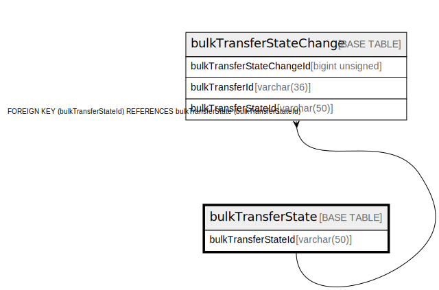

# bulkTransferState

## Description

<details>
<summary><strong>Table Definition</strong></summary>

```sql
CREATE TABLE `bulkTransferState` (
  `bulkTransferStateId` varchar(50) NOT NULL,
  `enumeration` varchar(50) NOT NULL COMMENT 'bulkTransferState associated to the Mojaloop API',
  `description` varchar(512) DEFAULT NULL,
  `isActive` tinyint(1) NOT NULL DEFAULT '1',
  `createdDate` datetime NOT NULL DEFAULT CURRENT_TIMESTAMP,
  PRIMARY KEY (`bulkTransferStateId`)
) ENGINE=InnoDB DEFAULT CHARSET=utf8mb4 COLLATE=utf8mb4_0900_ai_ci
```

</details>

## Columns

| Name                | Type         | Default           | Nullable | Extra Definition  | Children                                              | Comment                                          |
| ------------------- | ------------ | ----------------- | -------- | ----------------- | ----------------------------------------------------- | ------------------------------------------------ |
| bulkTransferStateId | varchar(50)  |                   | false    |                   | [bulkTransferStateChange](bulkTransferStateChange.md) |                                                  |
| enumeration         | varchar(50)  |                   | false    |                   |                                                       | bulkTransferState associated to the Mojaloop API |
| description         | varchar(512) |                   | true     |                   |                                                       |                                                  |
| isActive            | tinyint(1)   | 1                 | false    |                   |                                                       |                                                  |
| createdDate         | datetime     | CURRENT_TIMESTAMP | false    | DEFAULT_GENERATED |                                                       |                                                  |

## Constraints

| Name    | Type        | Definition                        |
| ------- | ----------- | --------------------------------- |
| PRIMARY | PRIMARY KEY | PRIMARY KEY (bulkTransferStateId) |

## Indexes

| Name    | Definition                                    |
| ------- | --------------------------------------------- |
| PRIMARY | PRIMARY KEY (bulkTransferStateId) USING BTREE |

## Relations



---

> Generated by [tbls](https://github.com/k1LoW/tbls)
