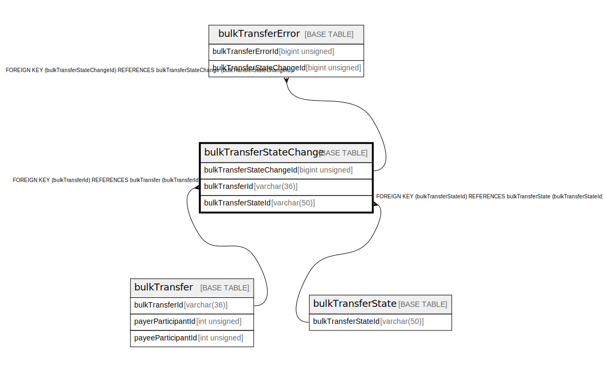

# bulkTransferStateChange

## Description

<details>
<summary><strong>Table Definition</strong></summary>

```sql
CREATE TABLE `bulkTransferStateChange` (
  `bulkTransferStateChangeId` bigint unsigned NOT NULL AUTO_INCREMENT,
  `bulkTransferId` varchar(36) NOT NULL,
  `bulkTransferStateId` varchar(50) NOT NULL,
  `reason` varchar(512) DEFAULT NULL,
  `createdDate` datetime NOT NULL DEFAULT CURRENT_TIMESTAMP,
  PRIMARY KEY (`bulkTransferStateChangeId`),
  KEY `bulktransferstatechange_bulktransferid_index` (`bulkTransferId`),
  KEY `bulktransferstatechange_bulktransferstateid_index` (`bulkTransferStateId`),
  CONSTRAINT `bulktransferstatechange_bulktransferid_foreign` FOREIGN KEY (`bulkTransferId`) REFERENCES `bulkTransfer` (`bulkTransferId`),
  CONSTRAINT `bulktransferstatechange_bulktransferstateid_foreign` FOREIGN KEY (`bulkTransferStateId`) REFERENCES `bulkTransferState` (`bulkTransferStateId`)
) ENGINE=InnoDB DEFAULT CHARSET=utf8mb4 COLLATE=utf8mb4_0900_ai_ci
```

</details>

## Columns

| Name | Type | Default | Nullable | Extra Definition | Children | Parents | Comment |
| ---- | ---- | ------- | -------- | ---------------- | -------- | ------- | ------- |
| bulkTransferStateChangeId | bigint unsigned |  | false | auto_increment | [bulkTransferError](bulkTransferError.md) |  |  |
| bulkTransferId | varchar(36) |  | false |  |  | [bulkTransfer](bulkTransfer.md) |  |
| bulkTransferStateId | varchar(50) |  | false |  |  | [bulkTransferState](bulkTransferState.md) |  |
| reason | varchar(512) |  | true |  |  |  |  |
| createdDate | datetime | CURRENT_TIMESTAMP | false | DEFAULT_GENERATED |  |  |  |

## Constraints

| Name | Type | Definition |
| ---- | ---- | ---------- |
| bulktransferstatechange_bulktransferid_foreign | FOREIGN KEY | FOREIGN KEY (bulkTransferId) REFERENCES bulkTransfer (bulkTransferId) |
| bulktransferstatechange_bulktransferstateid_foreign | FOREIGN KEY | FOREIGN KEY (bulkTransferStateId) REFERENCES bulkTransferState (bulkTransferStateId) |
| PRIMARY | PRIMARY KEY | PRIMARY KEY (bulkTransferStateChangeId) |

## Indexes

| Name | Definition |
| ---- | ---------- |
| bulktransferstatechange_bulktransferid_index | KEY bulktransferstatechange_bulktransferid_index (bulkTransferId) USING BTREE |
| bulktransferstatechange_bulktransferstateid_index | KEY bulktransferstatechange_bulktransferstateid_index (bulkTransferStateId) USING BTREE |
| PRIMARY | PRIMARY KEY (bulkTransferStateChangeId) USING BTREE |

## Relations



---

> Generated by [tbls](https://github.com/k1LoW/tbls)
