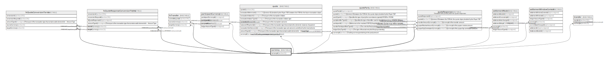

# currency

## Description

<details>
<summary><strong>Table Definition</strong></summary>

```sql
CREATE TABLE `currency` (
  `currencyId` varchar(3) NOT NULL,
  `name` varchar(128) DEFAULT NULL,
  `isActive` tinyint(1) NOT NULL DEFAULT '1',
  `createdDate` datetime NOT NULL DEFAULT CURRENT_TIMESTAMP,
  `scale` int unsigned NOT NULL DEFAULT '4',
  PRIMARY KEY (`currencyId`)
) ENGINE=InnoDB DEFAULT CHARSET=utf8mb4 COLLATE=utf8mb4_0900_ai_ci
```

</details>

## Columns

| Name        | Type         | Default           | Nullable | Extra Definition  | Children                                                                                                                                                                                                                                                                                                                                                                                              |
| ----------- | ------------ | ----------------- | -------- | ----------------- | ----------------------------------------------------------------------------------------------------------------------------------------------------------------------------------------------------------------------------------------------------------------------------------------------------------------------------------------------------------------------------------------------------- |
| currencyId  | varchar(3)   |                   | false    |                   | [fxQuoteConversionTerms](fxQuoteConversionTerms.md) [fxQuoteResponseConversionTerms](fxQuoteResponseConversionTerms.md) [fxTransfer](fxTransfer.md) [participantCurrency](participantCurrency.md) [quote](quote.md) [quoteParty](quoteParty.md) [quoteResponse](quoteResponse.md) [settlementModel](settlementModel.md) [settlementWindowContent](settlementWindowContent.md) [transfer](transfer.md) |
| name        | varchar(128) |                   | true     |                   |                                                                                                                                                                                                                                                                                                                                                                                                       |
| isActive    | tinyint(1)   | 1                 | false    |                   |                                                                                                                                                                                                                                                                                                                                                                                                       |
| createdDate | datetime     | CURRENT_TIMESTAMP | false    | DEFAULT_GENERATED |                                                                                                                                                                                                                                                                                                                                                                                                       |
| scale       | int unsigned | 4                 | false    |                   |                                                                                                                                                                                                                                                                                                                                                                                                       |

## Constraints

| Name    | Type        | Definition               |
| ------- | ----------- | ------------------------ |
| PRIMARY | PRIMARY KEY | PRIMARY KEY (currencyId) |

## Indexes

| Name    | Definition                           |
| ------- | ------------------------------------ |
| PRIMARY | PRIMARY KEY (currencyId) USING BTREE |

## Relations



---

> Generated by [tbls](https://github.com/k1LoW/tbls)
