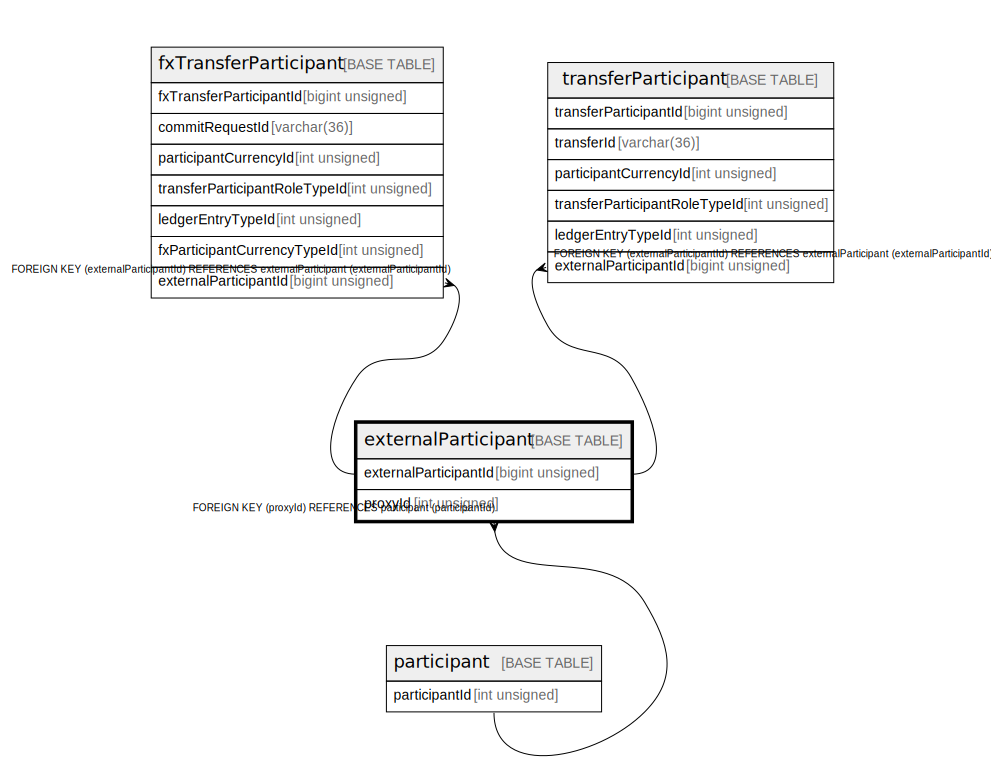

# externalParticipant

## Description

<details>
<summary><strong>Table Definition</strong></summary>

```sql
CREATE TABLE `externalParticipant` (
  `externalParticipantId` bigint unsigned NOT NULL AUTO_INCREMENT,
  `name` varchar(30) NOT NULL,
  `createdDate` datetime NOT NULL DEFAULT CURRENT_TIMESTAMP,
  `proxyId` int unsigned NOT NULL,
  PRIMARY KEY (`externalParticipantId`),
  UNIQUE KEY `externalparticipant_name_unique` (`name`),
  KEY `externalparticipant_proxyid_foreign` (`proxyId`),
  CONSTRAINT `externalparticipant_proxyid_foreign` FOREIGN KEY (`proxyId`) REFERENCES `participant` (`participantId`)
) ENGINE=InnoDB DEFAULT CHARSET=utf8mb4 COLLATE=utf8mb4_0900_ai_ci
```

</details>

## Columns

| Name                  | Type            | Default           | Nullable | Extra Definition  | Children                                                                                        | Parents                       |
| --------------------- | --------------- | ----------------- | -------- | ----------------- | ----------------------------------------------------------------------------------------------- | ----------------------------- |
| externalParticipantId | bigint unsigned |                   | false    | auto_increment    | [fxTransferParticipant](fxTransferParticipant.md) [transferParticipant](transferParticipant.md) |                               |
| name                  | varchar(30)     |                   | false    |                   |                                                                                                 |                               |
| createdDate           | datetime        | CURRENT_TIMESTAMP | false    | DEFAULT_GENERATED |                                                                                                 |                               |
| proxyId               | int unsigned    |                   | false    |                   |                                                                                                 | [participant](participant.md) |

## Constraints

| Name                                | Type        | Definition                                                   |
| ----------------------------------- | ----------- | ------------------------------------------------------------ |
| externalparticipant_name_unique     | UNIQUE      | UNIQUE KEY externalparticipant_name_unique (name)            |
| externalparticipant_proxyid_foreign | FOREIGN KEY | FOREIGN KEY (proxyId) REFERENCES participant (participantId) |
| PRIMARY                             | PRIMARY KEY | PRIMARY KEY (externalParticipantId)                          |

## Indexes

| Name                                | Definition                                                    |
| ----------------------------------- | ------------------------------------------------------------- |
| externalparticipant_proxyid_foreign | KEY externalparticipant_proxyid_foreign (proxyId) USING BTREE |
| PRIMARY                             | PRIMARY KEY (externalParticipantId) USING BTREE               |
| externalparticipant_name_unique     | UNIQUE KEY externalparticipant_name_unique (name) USING BTREE |

## Relations



---

> Generated by [tbls](https://github.com/k1LoW/tbls)
