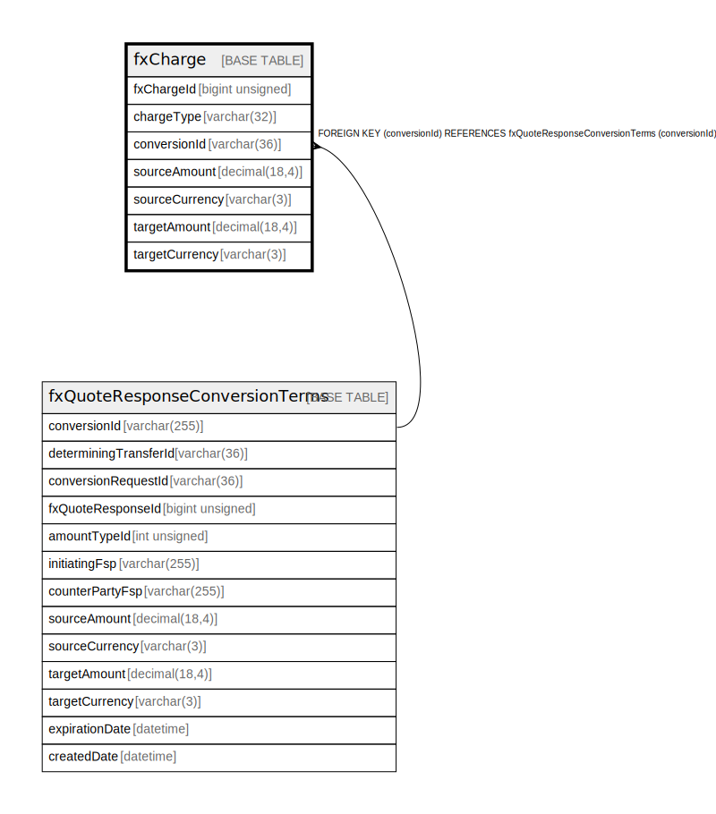

# fxCharge

## Description

<details>
<summary><strong>Table Definition</strong></summary>

```sql
CREATE TABLE `fxCharge` (
  `fxChargeId` bigint unsigned NOT NULL AUTO_INCREMENT,
  `chargeType` varchar(32) NOT NULL COMMENT 'A description of the charge which is being levied.',
  `conversionId` varchar(36) NOT NULL,
  `sourceAmount` decimal(18,4) DEFAULT NULL COMMENT 'The amount of the charge which is being levied, expressed in the source currency.',
  `sourceCurrency` varchar(3) DEFAULT NULL COMMENT 'The currency in which the source amount charge is being levied.',
  `targetAmount` decimal(18,4) DEFAULT NULL COMMENT 'The amount of the charge which is being levied, expressed in the target currency.',
  `targetCurrency` varchar(3) DEFAULT NULL COMMENT 'The currency in which the target amount charge is being levied.',
  PRIMARY KEY (`fxChargeId`),
  KEY `fxcharge_conversionid_foreign` (`conversionId`),
  CONSTRAINT `fxcharge_conversionid_foreign` FOREIGN KEY (`conversionId`) REFERENCES `fxQuoteResponseConversionTerms` (`conversionId`)
) ENGINE=InnoDB DEFAULT CHARSET=utf8mb4 COLLATE=utf8mb4_0900_ai_ci
```

</details>

## Columns

| Name           | Type            | Default | Nullable | Extra Definition | Parents                                                             | Comment                                                                           |
| -------------- | --------------- | ------- | -------- | ---------------- | ------------------------------------------------------------------- | --------------------------------------------------------------------------------- |
| fxChargeId     | bigint unsigned |         | false    | auto_increment   |                                                                     |                                                                                   |
| chargeType     | varchar(32)     |         | false    |                  |                                                                     | A description of the charge which is being levied.                                |
| conversionId   | varchar(36)     |         | false    |                  | [fxQuoteResponseConversionTerms](fxQuoteResponseConversionTerms.md) |                                                                                   |
| sourceAmount   | decimal(18,4)   |         | true     |                  |                                                                     | The amount of the charge which is being levied, expressed in the source currency. |
| sourceCurrency | varchar(3)      |         | true     |                  |                                                                     | The currency in which the source amount charge is being levied.                   |
| targetAmount   | decimal(18,4)   |         | true     |                  |                                                                     | The amount of the charge which is being levied, expressed in the target currency. |
| targetCurrency | varchar(3)      |         | true     |                  |                                                                     | The currency in which the target amount charge is being levied.                   |

## Constraints

| Name                          | Type        | Definition                                                                          |
| ----------------------------- | ----------- | ----------------------------------------------------------------------------------- |
| fxcharge_conversionid_foreign | FOREIGN KEY | FOREIGN KEY (conversionId) REFERENCES fxQuoteResponseConversionTerms (conversionId) |
| PRIMARY                       | PRIMARY KEY | PRIMARY KEY (fxChargeId)                                                            |

## Indexes

| Name                          | Definition                                                   |
| ----------------------------- | ------------------------------------------------------------ |
| fxcharge_conversionid_foreign | KEY fxcharge_conversionid_foreign (conversionId) USING BTREE |
| PRIMARY                       | PRIMARY KEY (fxChargeId) USING BTREE                         |

## Relations



---

> Generated by [tbls](https://github.com/k1LoW/tbls)
