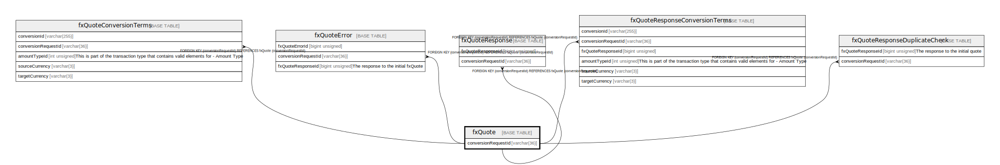

# fxQuote

## Description

<details>
<summary><strong>Table Definition</strong></summary>

```sql
CREATE TABLE `fxQuote` (
  `conversionRequestId` varchar(36) NOT NULL,
  `createdDate` datetime NOT NULL DEFAULT CURRENT_TIMESTAMP COMMENT 'System dateTime stamp pertaining to the inserted record',
  PRIMARY KEY (`conversionRequestId`)
) ENGINE=InnoDB DEFAULT CHARSET=utf8mb4 COLLATE=utf8mb4_0900_ai_ci
```

</details>

## Columns

| Name | Type | Default | Nullable | Extra Definition | Children | Parents | Comment |
| ---- | ---- | ------- | -------- | ---------------- | -------- | ------- | ------- |
| conversionRequestId | varchar(36) |  | false |  | [fxQuoteConversionTerms](fxQuoteConversionTerms.md) [fxQuoteError](fxQuoteError.md) [fxQuoteResponse](fxQuoteResponse.md) [fxQuoteResponseConversionTerms](fxQuoteResponseConversionTerms.md) [fxQuoteResponseDuplicateCheck](fxQuoteResponseDuplicateCheck.md) |  |  |
| createdDate | datetime | CURRENT_TIMESTAMP | false | DEFAULT_GENERATED |  |  | System dateTime stamp pertaining to the inserted record |

## Constraints

| Name | Type | Definition |
| ---- | ---- | ---------- |
| PRIMARY | PRIMARY KEY | PRIMARY KEY (conversionRequestId) |

## Indexes

| Name | Definition |
| ---- | ---------- |
| PRIMARY | PRIMARY KEY (conversionRequestId) USING BTREE |

## Relations



---

> Generated by [tbls](https://github.com/k1LoW/tbls)
