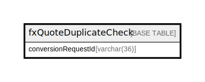

# fxQuoteDuplicateCheck

## Description

<details>
<summary><strong>Table Definition</strong></summary>

```sql
CREATE TABLE `fxQuoteDuplicateCheck` (
  `conversionRequestId` varchar(36) NOT NULL,
  `hash` varchar(1024) DEFAULT NULL COMMENT 'hash value received for the quote request',
  `createdDate` datetime NOT NULL DEFAULT CURRENT_TIMESTAMP COMMENT 'System dateTime stamp pertaining to the inserted record',
  PRIMARY KEY (`conversionRequestId`)
) ENGINE=InnoDB DEFAULT CHARSET=utf8mb4 COLLATE=utf8mb4_0900_ai_ci
```

</details>

## Columns

| Name | Type | Default | Nullable | Extra Definition | Children | Parents | Comment |
| ---- | ---- | ------- | -------- | ---------------- | -------- | ------- | ------- |
| conversionRequestId | varchar(36) |  | false |  |  |  |  |
| hash | varchar(1024) |  | true |  |  |  | hash value received for the quote request |
| createdDate | datetime | CURRENT_TIMESTAMP | false | DEFAULT_GENERATED |  |  | System dateTime stamp pertaining to the inserted record |

## Constraints

| Name | Type | Definition |
| ---- | ---- | ---------- |
| PRIMARY | PRIMARY KEY | PRIMARY KEY (conversionRequestId) |

## Indexes

| Name | Definition |
| ---- | ---------- |
| PRIMARY | PRIMARY KEY (conversionRequestId) USING BTREE |

## Relations



---

> Generated by [tbls](https://github.com/k1LoW/tbls)
