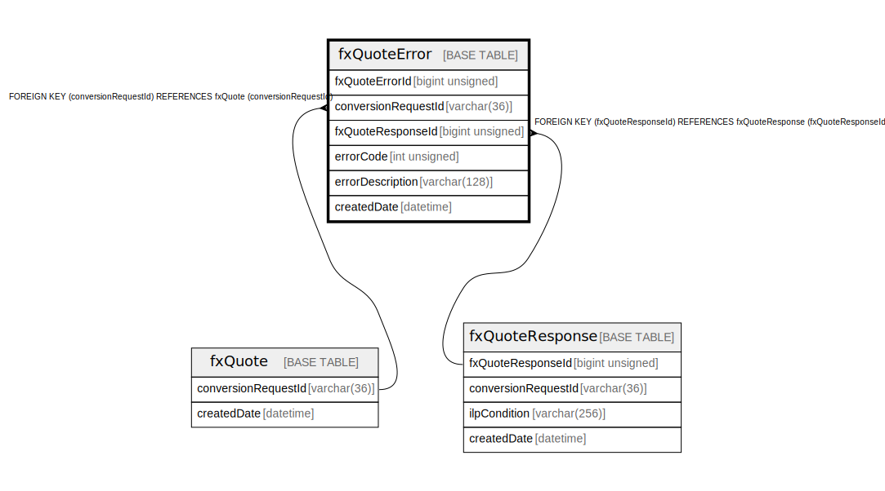

# fxQuoteError

## Description

<details>
<summary><strong>Table Definition</strong></summary>

```sql
CREATE TABLE `fxQuoteError` (
  `fxQuoteErrorId` bigint unsigned NOT NULL AUTO_INCREMENT,
  `conversionRequestId` varchar(36) NOT NULL,
  `fxQuoteResponseId` bigint unsigned DEFAULT NULL COMMENT 'The response to the initial fxQuote',
  `errorCode` int unsigned NOT NULL,
  `errorDescription` varchar(128) NOT NULL,
  `createdDate` datetime NOT NULL DEFAULT CURRENT_TIMESTAMP,
  PRIMARY KEY (`fxQuoteErrorId`),
  KEY `fxquoteerror_conversionrequestid_foreign` (`conversionRequestId`),
  KEY `fxquoteerror_fxquoteresponseid_foreign` (`fxQuoteResponseId`),
  CONSTRAINT `fxquoteerror_conversionrequestid_foreign` FOREIGN KEY (`conversionRequestId`) REFERENCES `fxQuote` (`conversionRequestId`),
  CONSTRAINT `fxquoteerror_fxquoteresponseid_foreign` FOREIGN KEY (`fxQuoteResponseId`) REFERENCES `fxQuoteResponse` (`fxQuoteResponseId`)
) ENGINE=InnoDB DEFAULT CHARSET=utf8mb4 COLLATE=utf8mb4_0900_ai_ci
```

</details>

## Columns

| Name | Type | Default | Nullable | Extra Definition | Children | Parents | Comment |
| ---- | ---- | ------- | -------- | ---------------- | -------- | ------- | ------- |
| fxQuoteErrorId | bigint unsigned |  | false | auto_increment |  |  |  |
| conversionRequestId | varchar(36) |  | false |  |  | [fxQuote](fxQuote.md) |  |
| fxQuoteResponseId | bigint unsigned |  | true |  |  | [fxQuoteResponse](fxQuoteResponse.md) | The response to the initial fxQuote |
| errorCode | int unsigned |  | false |  |  |  |  |
| errorDescription | varchar(128) |  | false |  |  |  |  |
| createdDate | datetime | CURRENT_TIMESTAMP | false | DEFAULT_GENERATED |  |  |  |

## Constraints

| Name | Type | Definition |
| ---- | ---- | ---------- |
| fxquoteerror_conversionrequestid_foreign | FOREIGN KEY | FOREIGN KEY (conversionRequestId) REFERENCES fxQuote (conversionRequestId) |
| fxquoteerror_fxquoteresponseid_foreign | FOREIGN KEY | FOREIGN KEY (fxQuoteResponseId) REFERENCES fxQuoteResponse (fxQuoteResponseId) |
| PRIMARY | PRIMARY KEY | PRIMARY KEY (fxQuoteErrorId) |

## Indexes

| Name | Definition |
| ---- | ---------- |
| fxquoteerror_conversionrequestid_foreign | KEY fxquoteerror_conversionrequestid_foreign (conversionRequestId) USING BTREE |
| fxquoteerror_fxquoteresponseid_foreign | KEY fxquoteerror_fxquoteresponseid_foreign (fxQuoteResponseId) USING BTREE |
| PRIMARY | PRIMARY KEY (fxQuoteErrorId) USING BTREE |

## Relations



---

> Generated by [tbls](https://github.com/k1LoW/tbls)
