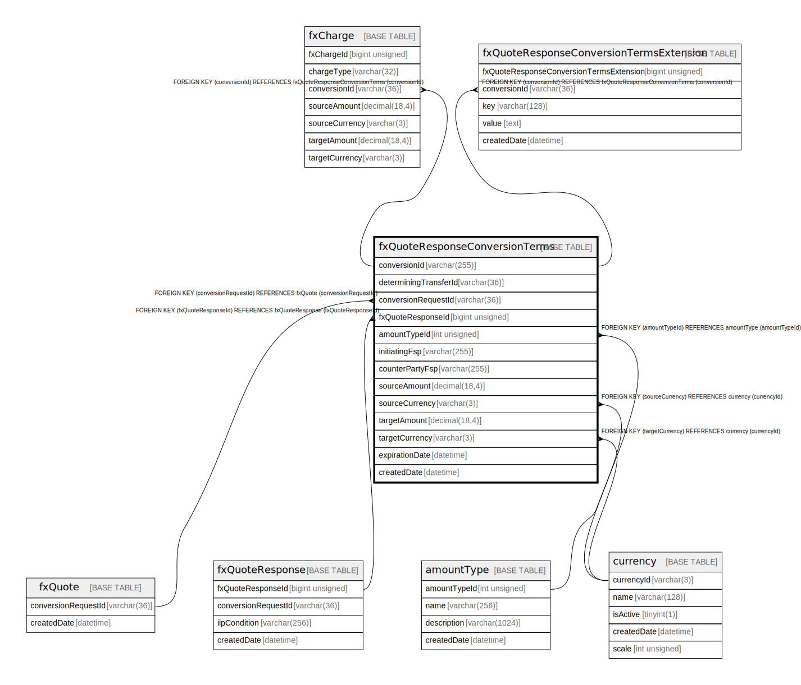

# fxQuoteResponseConversionTerms

## Description

<details>
<summary><strong>Table Definition</strong></summary>

```sql
CREATE TABLE `fxQuoteResponseConversionTerms` (
  `conversionId` varchar(255) NOT NULL,
  `determiningTransferId` varchar(36) DEFAULT NULL,
  `conversionRequestId` varchar(36) NOT NULL,
  `fxQuoteResponseId` bigint unsigned NOT NULL,
  `amountTypeId` int unsigned NOT NULL COMMENT 'This is part of the transaction type that contains valid elements for - Amount Type',
  `initiatingFsp` varchar(255) DEFAULT NULL,
  `counterPartyFsp` varchar(255) DEFAULT NULL,
  `sourceAmount` decimal(18,4) NOT NULL,
  `sourceCurrency` varchar(3) NOT NULL,
  `targetAmount` decimal(18,4) NOT NULL,
  `targetCurrency` varchar(3) NOT NULL,
  `expirationDate` datetime NOT NULL,
  `createdDate` datetime NOT NULL DEFAULT CURRENT_TIMESTAMP COMMENT 'System dateTime stamp pertaining to the inserted record',
  PRIMARY KEY (`conversionId`),
  KEY `fxquoteresponseconversionterms_conversionrequestid_foreign` (`conversionRequestId`),
  KEY `fxquoteresponseconversionterms_fxquoteresponseid_foreign` (`fxQuoteResponseId`),
  KEY `fxquoteresponseconversionterms_amounttypeid_foreign` (`amountTypeId`),
  KEY `fxquoteresponseconversionterms_sourcecurrency_foreign` (`sourceCurrency`),
  KEY `fxquoteresponseconversionterms_targetcurrency_foreign` (`targetCurrency`),
  CONSTRAINT `fxquoteresponseconversionterms_amounttypeid_foreign` FOREIGN KEY (`amountTypeId`) REFERENCES `amountType` (`amountTypeId`),
  CONSTRAINT `fxquoteresponseconversionterms_conversionrequestid_foreign` FOREIGN KEY (`conversionRequestId`) REFERENCES `fxQuote` (`conversionRequestId`),
  CONSTRAINT `fxquoteresponseconversionterms_fxquoteresponseid_foreign` FOREIGN KEY (`fxQuoteResponseId`) REFERENCES `fxQuoteResponse` (`fxQuoteResponseId`),
  CONSTRAINT `fxquoteresponseconversionterms_sourcecurrency_foreign` FOREIGN KEY (`sourceCurrency`) REFERENCES `currency` (`currencyId`),
  CONSTRAINT `fxquoteresponseconversionterms_targetcurrency_foreign` FOREIGN KEY (`targetCurrency`) REFERENCES `currency` (`currencyId`)
) ENGINE=InnoDB DEFAULT CHARSET=utf8mb4 COLLATE=utf8mb4_0900_ai_ci
```

</details>

## Columns

| Name                  | Type            | Default           | Nullable | Extra Definition  | Children                                                                                                      | Parents                               | Comment                                                                             |
| --------------------- | --------------- | ----------------- | -------- | ----------------- | ------------------------------------------------------------------------------------------------------------- | ------------------------------------- | ----------------------------------------------------------------------------------- |
| conversionId          | varchar(255)    |                   | false    |                   | [fxCharge](fxCharge.md) [fxQuoteResponseConversionTermsExtension](fxQuoteResponseConversionTermsExtension.md) |                                       |                                                                                     |
| determiningTransferId | varchar(36)     |                   | true     |                   |                                                                                                               |                                       |                                                                                     |
| conversionRequestId   | varchar(36)     |                   | false    |                   |                                                                                                               | [fxQuote](fxQuote.md)                 |                                                                                     |
| fxQuoteResponseId     | bigint unsigned |                   | false    |                   |                                                                                                               | [fxQuoteResponse](fxQuoteResponse.md) |                                                                                     |
| amountTypeId          | int unsigned    |                   | false    |                   |                                                                                                               | [amountType](amountType.md)           | This is part of the transaction type that contains valid elements for - Amount Type |
| initiatingFsp         | varchar(255)    |                   | true     |                   |                                                                                                               |                                       |                                                                                     |
| counterPartyFsp       | varchar(255)    |                   | true     |                   |                                                                                                               |                                       |                                                                                     |
| sourceAmount          | decimal(18,4)   |                   | false    |                   |                                                                                                               |                                       |                                                                                     |
| sourceCurrency        | varchar(3)      |                   | false    |                   |                                                                                                               | [currency](currency.md)               |                                                                                     |
| targetAmount          | decimal(18,4)   |                   | false    |                   |                                                                                                               |                                       |                                                                                     |
| targetCurrency        | varchar(3)      |                   | false    |                   |                                                                                                               | [currency](currency.md)               |                                                                                     |
| expirationDate        | datetime        |                   | false    |                   |                                                                                                               |                                       |                                                                                     |
| createdDate           | datetime        | CURRENT_TIMESTAMP | false    | DEFAULT_GENERATED |                                                                                                               |                                       | System dateTime stamp pertaining to the inserted record                             |

## Constraints

| Name                                                       | Type        | Definition                                                                     |
| ---------------------------------------------------------- | ----------- | ------------------------------------------------------------------------------ |
| fxquoteresponseconversionterms_amounttypeid_foreign        | FOREIGN KEY | FOREIGN KEY (amountTypeId) REFERENCES amountType (amountTypeId)                |
| fxquoteresponseconversionterms_conversionrequestid_foreign | FOREIGN KEY | FOREIGN KEY (conversionRequestId) REFERENCES fxQuote (conversionRequestId)     |
| fxquoteresponseconversionterms_fxquoteresponseid_foreign   | FOREIGN KEY | FOREIGN KEY (fxQuoteResponseId) REFERENCES fxQuoteResponse (fxQuoteResponseId) |
| fxquoteresponseconversionterms_sourcecurrency_foreign      | FOREIGN KEY | FOREIGN KEY (sourceCurrency) REFERENCES currency (currencyId)                  |
| fxquoteresponseconversionterms_targetcurrency_foreign      | FOREIGN KEY | FOREIGN KEY (targetCurrency) REFERENCES currency (currencyId)                  |
| PRIMARY                                                    | PRIMARY KEY | PRIMARY KEY (conversionId)                                                     |

## Indexes

| Name                                                       | Definition                                                                                       |
| ---------------------------------------------------------- | ------------------------------------------------------------------------------------------------ |
| fxquoteresponseconversionterms_amounttypeid_foreign        | KEY fxquoteresponseconversionterms_amounttypeid_foreign (amountTypeId) USING BTREE               |
| fxquoteresponseconversionterms_conversionrequestid_foreign | KEY fxquoteresponseconversionterms_conversionrequestid_foreign (conversionRequestId) USING BTREE |
| fxquoteresponseconversionterms_fxquoteresponseid_foreign   | KEY fxquoteresponseconversionterms_fxquoteresponseid_foreign (fxQuoteResponseId) USING BTREE     |
| fxquoteresponseconversionterms_sourcecurrency_foreign      | KEY fxquoteresponseconversionterms_sourcecurrency_foreign (sourceCurrency) USING BTREE           |
| fxquoteresponseconversionterms_targetcurrency_foreign      | KEY fxquoteresponseconversionterms_targetcurrency_foreign (targetCurrency) USING BTREE           |
| PRIMARY                                                    | PRIMARY KEY (conversionId) USING BTREE                                                           |

## Relations



---

> Generated by [tbls](https://github.com/k1LoW/tbls)
