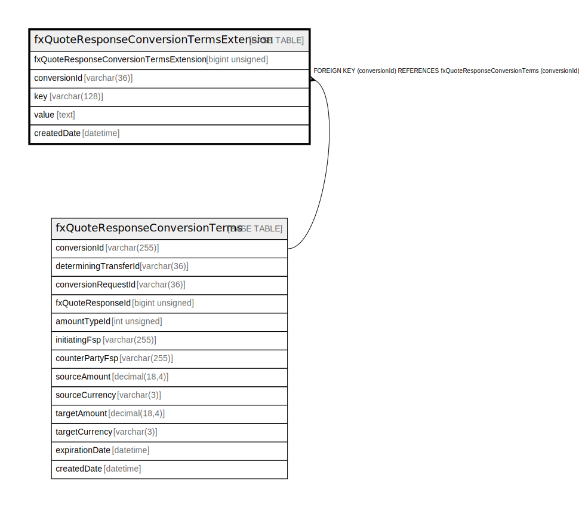

# fxQuoteResponseConversionTermsExtension

## Description

<details>
<summary><strong>Table Definition</strong></summary>

```sql
CREATE TABLE `fxQuoteResponseConversionTermsExtension` (
  `fxQuoteResponseConversionTermsExtension` bigint unsigned NOT NULL AUTO_INCREMENT,
  `conversionId` varchar(36) NOT NULL,
  `key` varchar(128) NOT NULL,
  `value` text NOT NULL,
  `createdDate` datetime NOT NULL DEFAULT CURRENT_TIMESTAMP COMMENT 'System dateTime stamp pertaining to the inserted record',
  PRIMARY KEY (`fxQuoteResponseConversionTermsExtension`),
  KEY `fxquoteresponseconversiontermsextension_conversionid_foreign` (`conversionId`),
  CONSTRAINT `fxquoteresponseconversiontermsextension_conversionid_foreign` FOREIGN KEY (`conversionId`) REFERENCES `fxQuoteResponseConversionTerms` (`conversionId`)
) ENGINE=InnoDB DEFAULT CHARSET=utf8mb4 COLLATE=utf8mb4_0900_ai_ci
```

</details>

## Columns

| Name                                    | Type            | Default           | Nullable | Extra Definition  | Parents                                                             | Comment                                                 |
| --------------------------------------- | --------------- | ----------------- | -------- | ----------------- | ------------------------------------------------------------------- | ------------------------------------------------------- |
| fxQuoteResponseConversionTermsExtension | bigint unsigned |                   | false    | auto_increment    |                                                                     |                                                         |
| conversionId                            | varchar(36)     |                   | false    |                   | [fxQuoteResponseConversionTerms](fxQuoteResponseConversionTerms.md) |                                                         |
| key                                     | varchar(128)    |                   | false    |                   |                                                                     |                                                         |
| value                                   | text            |                   | false    |                   |                                                                     |                                                         |
| createdDate                             | datetime        | CURRENT_TIMESTAMP | false    | DEFAULT_GENERATED |                                                                     | System dateTime stamp pertaining to the inserted record |

## Constraints

| Name                                                         | Type        | Definition                                                                          |
| ------------------------------------------------------------ | ----------- | ----------------------------------------------------------------------------------- |
| fxquoteresponseconversiontermsextension_conversionid_foreign | FOREIGN KEY | FOREIGN KEY (conversionId) REFERENCES fxQuoteResponseConversionTerms (conversionId) |
| PRIMARY                                                      | PRIMARY KEY | PRIMARY KEY (fxQuoteResponseConversionTermsExtension)                               |

## Indexes

| Name                                                         | Definition                                                                                  |
| ------------------------------------------------------------ | ------------------------------------------------------------------------------------------- |
| fxquoteresponseconversiontermsextension_conversionid_foreign | KEY fxquoteresponseconversiontermsextension_conversionid_foreign (conversionId) USING BTREE |
| PRIMARY                                                      | PRIMARY KEY (fxQuoteResponseConversionTermsExtension) USING BTREE                           |

## Relations



---

> Generated by [tbls](https://github.com/k1LoW/tbls)
