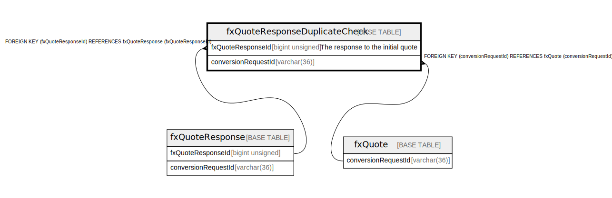

# fxQuoteResponseDuplicateCheck

## Description

<details>
<summary><strong>Table Definition</strong></summary>

```sql
CREATE TABLE `fxQuoteResponseDuplicateCheck` (
  `fxQuoteResponseId` bigint unsigned NOT NULL AUTO_INCREMENT COMMENT 'The response to the initial quote',
  `conversionRequestId` varchar(36) NOT NULL,
  `hash` varchar(255) DEFAULT NULL COMMENT 'hash value received for the quote response',
  `createdDate` datetime NOT NULL DEFAULT CURRENT_TIMESTAMP COMMENT 'System dateTime stamp pertaining to the inserted record',
  PRIMARY KEY (`fxQuoteResponseId`),
  KEY `fxquoteresponseduplicatecheck_conversionrequestid_foreign` (`conversionRequestId`),
  CONSTRAINT `fxquoteresponseduplicatecheck_conversionrequestid_foreign` FOREIGN KEY (`conversionRequestId`) REFERENCES `fxQuote` (`conversionRequestId`),
  CONSTRAINT `fxquoteresponseduplicatecheck_fxquoteresponseid_foreign` FOREIGN KEY (`fxQuoteResponseId`) REFERENCES `fxQuoteResponse` (`fxQuoteResponseId`)
) ENGINE=InnoDB DEFAULT CHARSET=utf8mb4 COLLATE=utf8mb4_0900_ai_ci
```

</details>

## Columns

| Name                | Type            | Default           | Nullable | Extra Definition  | Parents                               | Comment                                                 |
| ------------------- | --------------- | ----------------- | -------- | ----------------- | ------------------------------------- | ------------------------------------------------------- |
| fxQuoteResponseId   | bigint unsigned |                   | false    | auto_increment    | [fxQuoteResponse](fxQuoteResponse.md) | The response to the initial quote                       |
| conversionRequestId | varchar(36)     |                   | false    |                   | [fxQuote](fxQuote.md)                 |                                                         |
| hash                | varchar(255)    |                   | true     |                   |                                       | hash value received for the quote response              |
| createdDate         | datetime        | CURRENT_TIMESTAMP | false    | DEFAULT_GENERATED |                                       | System dateTime stamp pertaining to the inserted record |

## Constraints

| Name                                                      | Type        | Definition                                                                     |
| --------------------------------------------------------- | ----------- | ------------------------------------------------------------------------------ |
| fxquoteresponseduplicatecheck_conversionrequestid_foreign | FOREIGN KEY | FOREIGN KEY (conversionRequestId) REFERENCES fxQuote (conversionRequestId)     |
| fxquoteresponseduplicatecheck_fxquoteresponseid_foreign   | FOREIGN KEY | FOREIGN KEY (fxQuoteResponseId) REFERENCES fxQuoteResponse (fxQuoteResponseId) |
| PRIMARY                                                   | PRIMARY KEY | PRIMARY KEY (fxQuoteResponseId)                                                |

## Indexes

| Name                                                      | Definition                                                                                      |
| --------------------------------------------------------- | ----------------------------------------------------------------------------------------------- |
| fxquoteresponseduplicatecheck_conversionrequestid_foreign | KEY fxquoteresponseduplicatecheck_conversionrequestid_foreign (conversionRequestId) USING BTREE |
| PRIMARY                                                   | PRIMARY KEY (fxQuoteResponseId) USING BTREE                                                     |

## Relations



---

> Generated by [tbls](https://github.com/k1LoW/tbls)
