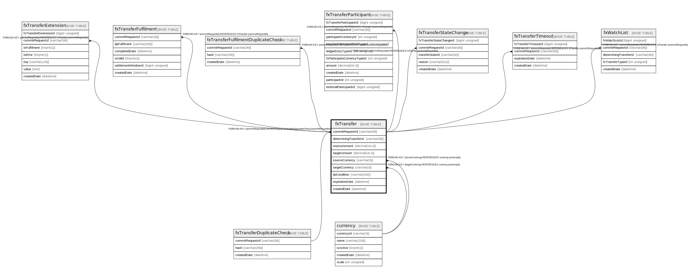

# fxTransfer

## Description

<details>
<summary><strong>Table Definition</strong></summary>

```sql
CREATE TABLE `fxTransfer` (
  `commitRequestId` varchar(36) NOT NULL,
  `determiningTransferId` varchar(36) DEFAULT NULL,
  `sourceAmount` decimal(18,4) NOT NULL,
  `targetAmount` decimal(18,4) NOT NULL,
  `sourceCurrency` varchar(3) NOT NULL,
  `targetCurrency` varchar(3) NOT NULL,
  `ilpCondition` varchar(256) NOT NULL,
  `expirationDate` datetime NOT NULL,
  `createdDate` datetime NOT NULL DEFAULT CURRENT_TIMESTAMP,
  PRIMARY KEY (`commitRequestId`),
  KEY `fxtransfer_sourcecurrency_index` (`sourceCurrency`),
  KEY `fxtransfer_targetcurrency_index` (`targetCurrency`),
  KEY `fxtransfer_determiningtransferid_index` (`determiningTransferId`),
  CONSTRAINT `fxtransfer_commitrequestid_foreign` FOREIGN KEY (`commitRequestId`) REFERENCES `fxTransferDuplicateCheck` (`commitRequestId`),
  CONSTRAINT `fxtransfer_sourcecurrency_foreign` FOREIGN KEY (`sourceCurrency`) REFERENCES `currency` (`currencyId`),
  CONSTRAINT `fxtransfer_targetcurrency_foreign` FOREIGN KEY (`targetCurrency`) REFERENCES `currency` (`currencyId`)
) ENGINE=InnoDB DEFAULT CHARSET=utf8mb4 COLLATE=utf8mb4_0900_ai_ci
```

</details>

## Columns

| Name                  | Type          | Default           | Nullable | Extra Definition  | Children                                                                                                                                                                                                                                                                                                                                              | Parents                                                 |
| --------------------- | ------------- | ----------------- | -------- | ----------------- | ----------------------------------------------------------------------------------------------------------------------------------------------------------------------------------------------------------------------------------------------------------------------------------------------------------------------------------------------------- | ------------------------------------------------------- |
| commitRequestId       | varchar(36)   |                   | false    |                   | [fxTransferExtension](fxTransferExtension.md) [fxTransferFulfilment](fxTransferFulfilment.md) [fxTransferFulfilmentDuplicateCheck](fxTransferFulfilmentDuplicateCheck.md) [fxTransferParticipant](fxTransferParticipant.md) [fxTransferStateChange](fxTransferStateChange.md) [fxTransferTimeout](fxTransferTimeout.md) [fxWatchList](fxWatchList.md) | [fxTransferDuplicateCheck](fxTransferDuplicateCheck.md) |
| determiningTransferId | varchar(36)   |                   | true     |                   |                                                                                                                                                                                                                                                                                                                                                       |                                                         |
| sourceAmount          | decimal(18,4) |                   | false    |                   |                                                                                                                                                                                                                                                                                                                                                       |                                                         |
| targetAmount          | decimal(18,4) |                   | false    |                   |                                                                                                                                                                                                                                                                                                                                                       |                                                         |
| sourceCurrency        | varchar(3)    |                   | false    |                   |                                                                                                                                                                                                                                                                                                                                                       | [currency](currency.md)                                 |
| targetCurrency        | varchar(3)    |                   | false    |                   |                                                                                                                                                                                                                                                                                                                                                       | [currency](currency.md)                                 |
| ilpCondition          | varchar(256)  |                   | false    |                   |                                                                                                                                                                                                                                                                                                                                                       |                                                         |
| expirationDate        | datetime      |                   | false    |                   |                                                                                                                                                                                                                                                                                                                                                       |                                                         |
| createdDate           | datetime      | CURRENT_TIMESTAMP | false    | DEFAULT_GENERATED |                                                                                                                                                                                                                                                                                                                                                       |                                                         |

## Constraints

| Name                               | Type        | Definition                                                                          |
| ---------------------------------- | ----------- | ----------------------------------------------------------------------------------- |
| fxtransfer_commitrequestid_foreign | FOREIGN KEY | FOREIGN KEY (commitRequestId) REFERENCES fxTransferDuplicateCheck (commitRequestId) |
| fxtransfer_sourcecurrency_foreign  | FOREIGN KEY | FOREIGN KEY (sourceCurrency) REFERENCES currency (currencyId)                       |
| fxtransfer_targetcurrency_foreign  | FOREIGN KEY | FOREIGN KEY (targetCurrency) REFERENCES currency (currencyId)                       |
| PRIMARY                            | PRIMARY KEY | PRIMARY KEY (commitRequestId)                                                       |

## Indexes

| Name                                   | Definition                                                                     |
| -------------------------------------- | ------------------------------------------------------------------------------ |
| fxtransfer_determiningtransferid_index | KEY fxtransfer_determiningtransferid_index (determiningTransferId) USING BTREE |
| fxtransfer_sourcecurrency_index        | KEY fxtransfer_sourcecurrency_index (sourceCurrency) USING BTREE               |
| fxtransfer_targetcurrency_index        | KEY fxtransfer_targetcurrency_index (targetCurrency) USING BTREE               |
| PRIMARY                                | PRIMARY KEY (commitRequestId) USING BTREE                                      |

## Relations



---

> Generated by [tbls](https://github.com/k1LoW/tbls)
