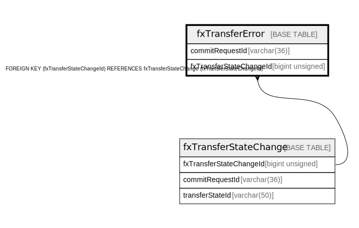

# fxTransferError

## Description

<details>
<summary><strong>Table Definition</strong></summary>

```sql
CREATE TABLE `fxTransferError` (
  `commitRequestId` varchar(36) NOT NULL,
  `fxTransferStateChangeId` bigint unsigned NOT NULL,
  `errorCode` int unsigned NOT NULL,
  `errorDescription` varchar(128) NOT NULL,
  `createdDate` datetime NOT NULL DEFAULT CURRENT_TIMESTAMP,
  PRIMARY KEY (`commitRequestId`),
  KEY `fxtransfererror_fxtransferstatechangeid_index` (`fxTransferStateChangeId`),
  CONSTRAINT `fxtransfererror_fxtransferstatechangeid_foreign` FOREIGN KEY (`fxTransferStateChangeId`) REFERENCES `fxTransferStateChange` (`fxTransferStateChangeId`)
) ENGINE=InnoDB DEFAULT CHARSET=utf8mb4 COLLATE=utf8mb4_0900_ai_ci
```

</details>

## Columns

| Name                    | Type            | Default           | Nullable | Extra Definition  | Parents                                           |
| ----------------------- | --------------- | ----------------- | -------- | ----------------- | ------------------------------------------------- |
| commitRequestId         | varchar(36)     |                   | false    |                   |                                                   |
| fxTransferStateChangeId | bigint unsigned |                   | false    |                   | [fxTransferStateChange](fxTransferStateChange.md) |
| errorCode               | int unsigned    |                   | false    |                   |                                                   |
| errorDescription        | varchar(128)    |                   | false    |                   |                                                   |
| createdDate             | datetime        | CURRENT_TIMESTAMP | false    | DEFAULT_GENERATED |                                                   |

## Constraints

| Name                                            | Type        | Definition                                                                                       |
| ----------------------------------------------- | ----------- | ------------------------------------------------------------------------------------------------ |
| fxtransfererror_fxtransferstatechangeid_foreign | FOREIGN KEY | FOREIGN KEY (fxTransferStateChangeId) REFERENCES fxTransferStateChange (fxTransferStateChangeId) |
| PRIMARY                                         | PRIMARY KEY | PRIMARY KEY (commitRequestId)                                                                    |

## Indexes

| Name                                          | Definition                                                                              |
| --------------------------------------------- | --------------------------------------------------------------------------------------- |
| fxtransfererror_fxtransferstatechangeid_index | KEY fxtransfererror_fxtransferstatechangeid_index (fxTransferStateChangeId) USING BTREE |
| PRIMARY                                       | PRIMARY KEY (commitRequestId) USING BTREE                                               |

## Relations



---

> Generated by [tbls](https://github.com/k1LoW/tbls)
