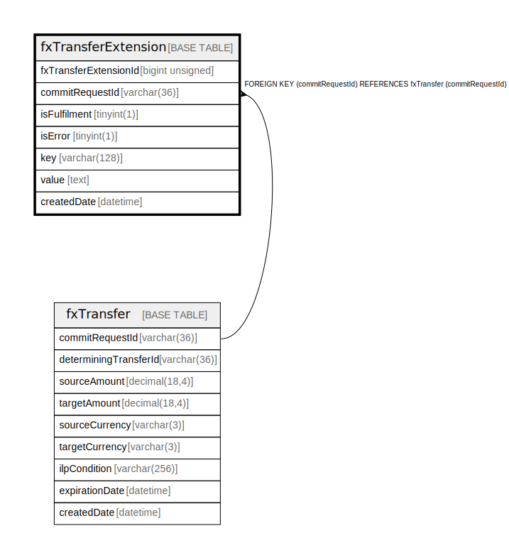

# fxTransferExtension

## Description

<details>
<summary><strong>Table Definition</strong></summary>

```sql
CREATE TABLE `fxTransferExtension` (
  `fxTransferExtensionId` bigint unsigned NOT NULL AUTO_INCREMENT,
  `commitRequestId` varchar(36) NOT NULL,
  `isFulfilment` tinyint(1) NOT NULL DEFAULT '0',
  `isError` tinyint(1) NOT NULL DEFAULT '0',
  `key` varchar(128) NOT NULL,
  `value` text NOT NULL,
  `createdDate` datetime NOT NULL DEFAULT CURRENT_TIMESTAMP,
  PRIMARY KEY (`fxTransferExtensionId`),
  KEY `fxtransferextension_commitrequestid_index` (`commitRequestId`),
  CONSTRAINT `fxtransferextension_commitrequestid_foreign` FOREIGN KEY (`commitRequestId`) REFERENCES `fxTransfer` (`commitRequestId`)
) ENGINE=InnoDB DEFAULT CHARSET=utf8mb4 COLLATE=utf8mb4_0900_ai_ci
```

</details>

## Columns

| Name                  | Type            | Default           | Nullable | Extra Definition  | Parents                     |
| --------------------- | --------------- | ----------------- | -------- | ----------------- | --------------------------- |
| fxTransferExtensionId | bigint unsigned |                   | false    | auto_increment    |                             |
| commitRequestId       | varchar(36)     |                   | false    |                   | [fxTransfer](fxTransfer.md) |
| isFulfilment          | tinyint(1)      | 0                 | false    |                   |                             |
| isError               | tinyint(1)      | 0                 | false    |                   |                             |
| key                   | varchar(128)    |                   | false    |                   |                             |
| value                 | text            |                   | false    |                   |                             |
| createdDate           | datetime        | CURRENT_TIMESTAMP | false    | DEFAULT_GENERATED |                             |

## Constraints

| Name                                        | Type        | Definition                                                            |
| ------------------------------------------- | ----------- | --------------------------------------------------------------------- |
| fxtransferextension_commitrequestid_foreign | FOREIGN KEY | FOREIGN KEY (commitRequestId) REFERENCES fxTransfer (commitRequestId) |
| PRIMARY                                     | PRIMARY KEY | PRIMARY KEY (fxTransferExtensionId)                                   |

## Indexes

| Name                                      | Definition                                                                  |
| ----------------------------------------- | --------------------------------------------------------------------------- |
| fxtransferextension_commitrequestid_index | KEY fxtransferextension_commitrequestid_index (commitRequestId) USING BTREE |
| PRIMARY                                   | PRIMARY KEY (fxTransferExtensionId) USING BTREE                             |

## Relations



---

> Generated by [tbls](https://github.com/k1LoW/tbls)
