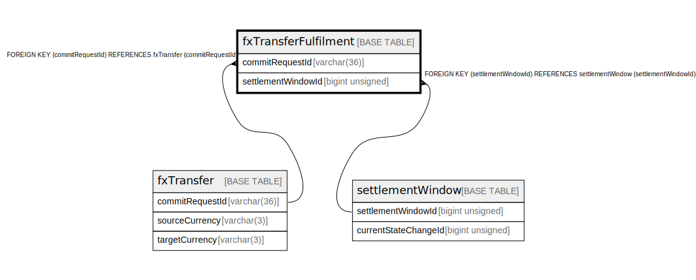

# fxTransferFulfilment

## Description

<details>
<summary><strong>Table Definition</strong></summary>

```sql
CREATE TABLE `fxTransferFulfilment` (
  `commitRequestId` varchar(36) NOT NULL,
  `ilpFulfilment` varchar(256) DEFAULT NULL,
  `completedDate` datetime NOT NULL,
  `isValid` tinyint(1) DEFAULT NULL,
  `settlementWindowId` bigint unsigned DEFAULT NULL,
  `createdDate` datetime NOT NULL DEFAULT CURRENT_TIMESTAMP,
  PRIMARY KEY (`commitRequestId`),
  UNIQUE KEY `fxtransferfulfilment_commitrequestid_ilpfulfilment_unique` (`commitRequestId`,`ilpFulfilment`),
  KEY `fxtransferfulfilment_commitrequestid_index` (`commitRequestId`),
  KEY `fxtransferfulfilment_settlementwindowid_index` (`settlementWindowId`),
  CONSTRAINT `fxtransferfulfilment_commitrequestid_foreign` FOREIGN KEY (`commitRequestId`) REFERENCES `fxTransfer` (`commitRequestId`),
  CONSTRAINT `fxtransferfulfilment_settlementwindowid_foreign` FOREIGN KEY (`settlementWindowId`) REFERENCES `settlementWindow` (`settlementWindowId`)
) ENGINE=InnoDB DEFAULT CHARSET=utf8mb4 COLLATE=utf8mb4_0900_ai_ci
```

</details>

## Columns

| Name               | Type            | Default           | Nullable | Extra Definition  | Parents                                 |
| ------------------ | --------------- | ----------------- | -------- | ----------------- | --------------------------------------- |
| commitRequestId    | varchar(36)     |                   | false    |                   | [fxTransfer](fxTransfer.md)             |
| ilpFulfilment      | varchar(256)    |                   | true     |                   |                                         |
| completedDate      | datetime        |                   | false    |                   |                                         |
| isValid            | tinyint(1)      |                   | true     |                   |                                         |
| settlementWindowId | bigint unsigned |                   | true     |                   | [settlementWindow](settlementWindow.md) |
| createdDate        | datetime        | CURRENT_TIMESTAMP | false    | DEFAULT_GENERATED |                                         |

## Constraints

| Name                                                      | Type        | Definition                                                                                            |
| --------------------------------------------------------- | ----------- | ----------------------------------------------------------------------------------------------------- |
| fxtransferfulfilment_commitrequestid_foreign              | FOREIGN KEY | FOREIGN KEY (commitRequestId) REFERENCES fxTransfer (commitRequestId)                                 |
| fxtransferfulfilment_commitrequestid_ilpfulfilment_unique | UNIQUE      | UNIQUE KEY fxtransferfulfilment_commitrequestid_ilpfulfilment_unique (commitRequestId, ilpFulfilment) |
| fxtransferfulfilment_settlementwindowid_foreign           | FOREIGN KEY | FOREIGN KEY (settlementWindowId) REFERENCES settlementWindow (settlementWindowId)                     |
| PRIMARY                                                   | PRIMARY KEY | PRIMARY KEY (commitRequestId)                                                                         |

## Indexes

| Name                                                      | Definition                                                                                                        |
| --------------------------------------------------------- | ----------------------------------------------------------------------------------------------------------------- |
| fxtransferfulfilment_commitrequestid_index                | KEY fxtransferfulfilment_commitrequestid_index (commitRequestId) USING BTREE                                      |
| fxtransferfulfilment_settlementwindowid_index             | KEY fxtransferfulfilment_settlementwindowid_index (settlementWindowId) USING BTREE                                |
| PRIMARY                                                   | PRIMARY KEY (commitRequestId) USING BTREE                                                                         |
| fxtransferfulfilment_commitrequestid_ilpfulfilment_unique | UNIQUE KEY fxtransferfulfilment_commitrequestid_ilpfulfilment_unique (commitRequestId, ilpFulfilment) USING BTREE |

## Relations



---

> Generated by [tbls](https://github.com/k1LoW/tbls)
