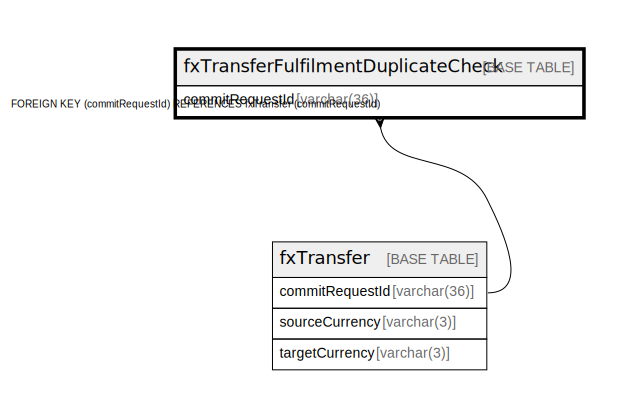

# fxTransferFulfilmentDuplicateCheck

## Description

<details>
<summary><strong>Table Definition</strong></summary>

```sql
CREATE TABLE `fxTransferFulfilmentDuplicateCheck` (
  `commitRequestId` varchar(36) NOT NULL,
  `hash` varchar(256) DEFAULT NULL,
  `createdDate` datetime NOT NULL DEFAULT CURRENT_TIMESTAMP,
  PRIMARY KEY (`commitRequestId`),
  KEY `fxtransferfulfilmentduplicatecheck_commitrequestid_index` (`commitRequestId`),
  CONSTRAINT `fxtransferfulfilmentduplicatecheck_commitrequestid_foreign` FOREIGN KEY (`commitRequestId`) REFERENCES `fxTransfer` (`commitRequestId`)
) ENGINE=InnoDB DEFAULT CHARSET=utf8mb4 COLLATE=utf8mb4_0900_ai_ci
```

</details>

## Columns

| Name            | Type         | Default           | Nullable | Extra Definition  | Parents                     |
| --------------- | ------------ | ----------------- | -------- | ----------------- | --------------------------- |
| commitRequestId | varchar(36)  |                   | false    |                   | [fxTransfer](fxTransfer.md) |
| hash            | varchar(256) |                   | true     |                   |                             |
| createdDate     | datetime     | CURRENT_TIMESTAMP | false    | DEFAULT_GENERATED |                             |

## Constraints

| Name                                                       | Type        | Definition                                                            |
| ---------------------------------------------------------- | ----------- | --------------------------------------------------------------------- |
| fxtransferfulfilmentduplicatecheck_commitrequestid_foreign | FOREIGN KEY | FOREIGN KEY (commitRequestId) REFERENCES fxTransfer (commitRequestId) |
| PRIMARY                                                    | PRIMARY KEY | PRIMARY KEY (commitRequestId)                                         |

## Indexes

| Name                                                     | Definition                                                                                 |
| -------------------------------------------------------- | ------------------------------------------------------------------------------------------ |
| fxtransferfulfilmentduplicatecheck_commitrequestid_index | KEY fxtransferfulfilmentduplicatecheck_commitrequestid_index (commitRequestId) USING BTREE |
| PRIMARY                                                  | PRIMARY KEY (commitRequestId) USING BTREE                                                  |

## Relations



---

> Generated by [tbls](https://github.com/k1LoW/tbls)
