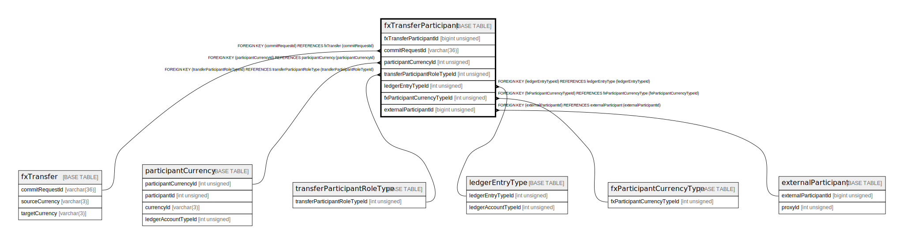

# fxTransferParticipant

## Description

<details>
<summary><strong>Table Definition</strong></summary>

```sql
CREATE TABLE `fxTransferParticipant` (
  `fxTransferParticipantId` bigint unsigned NOT NULL AUTO_INCREMENT,
  `commitRequestId` varchar(36) NOT NULL,
  `participantCurrencyId` int unsigned DEFAULT NULL,
  `transferParticipantRoleTypeId` int unsigned NOT NULL,
  `ledgerEntryTypeId` int unsigned NOT NULL,
  `fxParticipantCurrencyTypeId` int unsigned DEFAULT NULL,
  `amount` decimal(18,4) NOT NULL,
  `createdDate` datetime NOT NULL DEFAULT CURRENT_TIMESTAMP,
  `participantId` int unsigned NOT NULL,
  `externalParticipantId` bigint unsigned DEFAULT NULL,
  PRIMARY KEY (`fxTransferParticipantId`),
  KEY `fxtransferparticipant_fxparticipantcurrencytypeid_foreign` (`fxParticipantCurrencyTypeId`),
  KEY `fxtransferparticipant_commitrequestid_index` (`commitRequestId`),
  KEY `fxtransferparticipant_participantcurrencyid_index` (`participantCurrencyId`),
  KEY `fxtransferparticipant_transferparticipantroletypeid_index` (`transferParticipantRoleTypeId`),
  KEY `fxtransferparticipant_ledgerentrytypeid_index` (`ledgerEntryTypeId`),
  KEY `fxtransferparticipant_participantid_index` (`participantId`),
  KEY `fxtransferparticipant_externalparticipantid_index` (`externalParticipantId`),
  CONSTRAINT `fxtransferparticipant_commitrequestid_foreign` FOREIGN KEY (`commitRequestId`) REFERENCES `fxTransfer` (`commitRequestId`),
  CONSTRAINT `fxtransferparticipant_externalparticipantid_foreign` FOREIGN KEY (`externalParticipantId`) REFERENCES `externalParticipant` (`externalParticipantId`),
  CONSTRAINT `fxtransferparticipant_fxparticipantcurrencytypeid_foreign` FOREIGN KEY (`fxParticipantCurrencyTypeId`) REFERENCES `fxParticipantCurrencyType` (`fxParticipantCurrencyTypeId`),
  CONSTRAINT `fxtransferparticipant_ledgerentrytypeid_foreign` FOREIGN KEY (`ledgerEntryTypeId`) REFERENCES `ledgerEntryType` (`ledgerEntryTypeId`),
  CONSTRAINT `fxtransferparticipant_participantcurrencyid_foreign` FOREIGN KEY (`participantCurrencyId`) REFERENCES `participantCurrency` (`participantCurrencyId`),
  CONSTRAINT `fxtransferparticipant_transferparticipantroletypeid_foreign` FOREIGN KEY (`transferParticipantRoleTypeId`) REFERENCES `transferParticipantRoleType` (`transferParticipantRoleTypeId`)
) ENGINE=InnoDB DEFAULT CHARSET=utf8mb4 COLLATE=utf8mb4_0900_ai_ci
```

</details>

## Columns

| Name                          | Type            | Default           | Nullable | Extra Definition  | Parents                                                       |
| ----------------------------- | --------------- | ----------------- | -------- | ----------------- | ------------------------------------------------------------- |
| fxTransferParticipantId       | bigint unsigned |                   | false    | auto_increment    |                                                               |
| commitRequestId               | varchar(36)     |                   | false    |                   | [fxTransfer](fxTransfer.md)                                   |
| participantCurrencyId         | int unsigned    |                   | true     |                   | [participantCurrency](participantCurrency.md)                 |
| transferParticipantRoleTypeId | int unsigned    |                   | false    |                   | [transferParticipantRoleType](transferParticipantRoleType.md) |
| ledgerEntryTypeId             | int unsigned    |                   | false    |                   | [ledgerEntryType](ledgerEntryType.md)                         |
| fxParticipantCurrencyTypeId   | int unsigned    |                   | true     |                   | [fxParticipantCurrencyType](fxParticipantCurrencyType.md)     |
| amount                        | decimal(18,4)   |                   | false    |                   |                                                               |
| createdDate                   | datetime        | CURRENT_TIMESTAMP | false    | DEFAULT_GENERATED |                                                               |
| participantId                 | int unsigned    |                   | false    |                   |                                                               |
| externalParticipantId         | bigint unsigned |                   | true     |                   | [externalParticipant](externalParticipant.md)                 |

## Constraints

| Name                                                        | Type        | Definition                                                                                                         |
| ----------------------------------------------------------- | ----------- | ------------------------------------------------------------------------------------------------------------------ |
| fxtransferparticipant_commitrequestid_foreign               | FOREIGN KEY | FOREIGN KEY (commitRequestId) REFERENCES fxTransfer (commitRequestId)                                              |
| fxtransferparticipant_externalparticipantid_foreign         | FOREIGN KEY | FOREIGN KEY (externalParticipantId) REFERENCES externalParticipant (externalParticipantId)                         |
| fxtransferparticipant_fxparticipantcurrencytypeid_foreign   | FOREIGN KEY | FOREIGN KEY (fxParticipantCurrencyTypeId) REFERENCES fxParticipantCurrencyType (fxParticipantCurrencyTypeId)       |
| fxtransferparticipant_ledgerentrytypeid_foreign             | FOREIGN KEY | FOREIGN KEY (ledgerEntryTypeId) REFERENCES ledgerEntryType (ledgerEntryTypeId)                                     |
| fxtransferparticipant_participantcurrencyid_foreign         | FOREIGN KEY | FOREIGN KEY (participantCurrencyId) REFERENCES participantCurrency (participantCurrencyId)                         |
| fxtransferparticipant_transferparticipantroletypeid_foreign | FOREIGN KEY | FOREIGN KEY (transferParticipantRoleTypeId) REFERENCES transferParticipantRoleType (transferParticipantRoleTypeId) |
| PRIMARY                                                     | PRIMARY KEY | PRIMARY KEY (fxTransferParticipantId)                                                                              |

## Indexes

| Name                                                      | Definition                                                                                                |
| --------------------------------------------------------- | --------------------------------------------------------------------------------------------------------- |
| fxtransferparticipant_commitrequestid_index               | KEY fxtransferparticipant_commitrequestid_index (commitRequestId) USING BTREE                             |
| fxtransferparticipant_externalparticipantid_index         | KEY fxtransferparticipant_externalparticipantid_index (externalParticipantId) USING BTREE                 |
| fxtransferparticipant_fxparticipantcurrencytypeid_foreign | KEY fxtransferparticipant_fxparticipantcurrencytypeid_foreign (fxParticipantCurrencyTypeId) USING BTREE   |
| fxtransferparticipant_ledgerentrytypeid_index             | KEY fxtransferparticipant_ledgerentrytypeid_index (ledgerEntryTypeId) USING BTREE                         |
| fxtransferparticipant_participantcurrencyid_index         | KEY fxtransferparticipant_participantcurrencyid_index (participantCurrencyId) USING BTREE                 |
| fxtransferparticipant_participantid_index                 | KEY fxtransferparticipant_participantid_index (participantId) USING BTREE                                 |
| fxtransferparticipant_transferparticipantroletypeid_index | KEY fxtransferparticipant_transferparticipantroletypeid_index (transferParticipantRoleTypeId) USING BTREE |
| PRIMARY                                                   | PRIMARY KEY (fxTransferParticipantId) USING BTREE                                                         |

## Relations



---

> Generated by [tbls](https://github.com/k1LoW/tbls)
