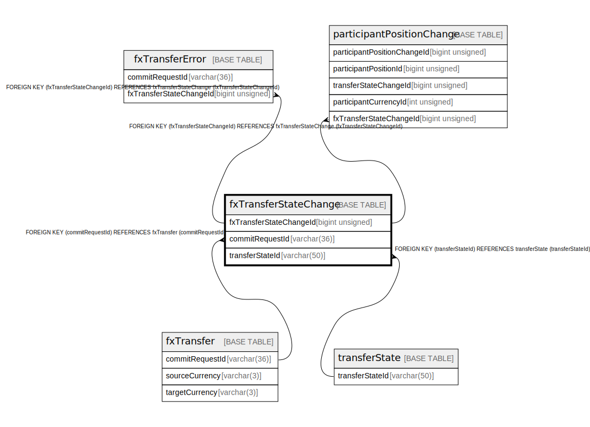

# fxTransferStateChange

## Description

<details>
<summary><strong>Table Definition</strong></summary>

```sql
CREATE TABLE `fxTransferStateChange` (
  `fxTransferStateChangeId` bigint unsigned NOT NULL AUTO_INCREMENT,
  `commitRequestId` varchar(36) NOT NULL,
  `transferStateId` varchar(50) NOT NULL,
  `reason` varchar(512) DEFAULT NULL,
  `createdDate` datetime NOT NULL DEFAULT CURRENT_TIMESTAMP,
  PRIMARY KEY (`fxTransferStateChangeId`),
  KEY `fxtransferstatechange_commitrequestid_index` (`commitRequestId`),
  KEY `fxtransferstatechange_transferstateid_index` (`transferStateId`),
  CONSTRAINT `fxtransferstatechange_commitrequestid_foreign` FOREIGN KEY (`commitRequestId`) REFERENCES `fxTransfer` (`commitRequestId`),
  CONSTRAINT `fxtransferstatechange_transferstateid_foreign` FOREIGN KEY (`transferStateId`) REFERENCES `transferState` (`transferStateId`)
) ENGINE=InnoDB DEFAULT CHARSET=utf8mb4 COLLATE=utf8mb4_0900_ai_ci
```

</details>

## Columns

| Name | Type | Default | Nullable | Extra Definition | Children | Parents | Comment |
| ---- | ---- | ------- | -------- | ---------------- | -------- | ------- | ------- |
| fxTransferStateChangeId | bigint unsigned |  | false | auto_increment | [fxTransferError](fxTransferError.md) [participantPositionChange](participantPositionChange.md) |  |  |
| commitRequestId | varchar(36) |  | false |  |  | [fxTransfer](fxTransfer.md) |  |
| transferStateId | varchar(50) |  | false |  |  | [transferState](transferState.md) |  |
| reason | varchar(512) |  | true |  |  |  |  |
| createdDate | datetime | CURRENT_TIMESTAMP | false | DEFAULT_GENERATED |  |  |  |

## Constraints

| Name | Type | Definition |
| ---- | ---- | ---------- |
| fxtransferstatechange_commitrequestid_foreign | FOREIGN KEY | FOREIGN KEY (commitRequestId) REFERENCES fxTransfer (commitRequestId) |
| fxtransferstatechange_transferstateid_foreign | FOREIGN KEY | FOREIGN KEY (transferStateId) REFERENCES transferState (transferStateId) |
| PRIMARY | PRIMARY KEY | PRIMARY KEY (fxTransferStateChangeId) |

## Indexes

| Name | Definition |
| ---- | ---------- |
| fxtransferstatechange_commitrequestid_index | KEY fxtransferstatechange_commitrequestid_index (commitRequestId) USING BTREE |
| fxtransferstatechange_transferstateid_index | KEY fxtransferstatechange_transferstateid_index (transferStateId) USING BTREE |
| PRIMARY | PRIMARY KEY (fxTransferStateChangeId) USING BTREE |

## Relations



---

> Generated by [tbls](https://github.com/k1LoW/tbls)
