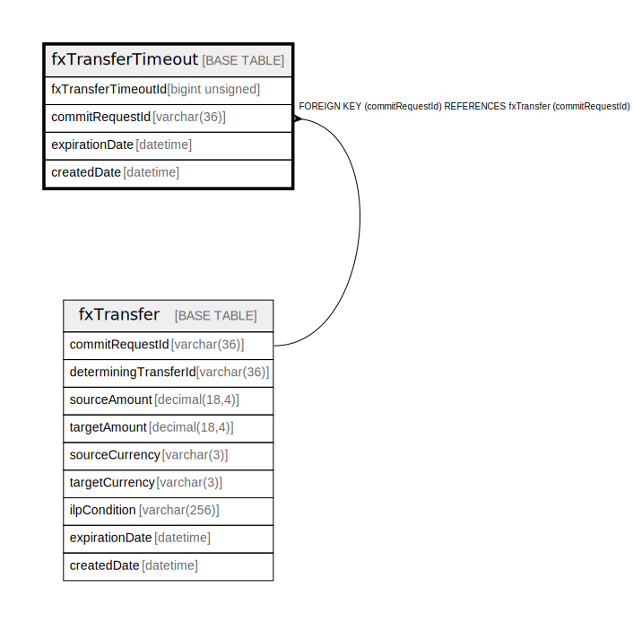

# fxTransferTimeout

## Description

<details>
<summary><strong>Table Definition</strong></summary>

```sql
CREATE TABLE `fxTransferTimeout` (
  `fxTransferTimeoutId` bigint unsigned NOT NULL AUTO_INCREMENT,
  `commitRequestId` varchar(36) NOT NULL,
  `expirationDate` datetime NOT NULL,
  `createdDate` datetime NOT NULL DEFAULT CURRENT_TIMESTAMP,
  PRIMARY KEY (`fxTransferTimeoutId`),
  UNIQUE KEY `fxtransfertimeout_commitrequestid_unique` (`commitRequestId`),
  KEY `fxtransfertimeout_expirationdate_index` (`expirationDate`),
  CONSTRAINT `fxtransfertimeout_commitrequestid_foreign` FOREIGN KEY (`commitRequestId`) REFERENCES `fxTransfer` (`commitRequestId`)
) ENGINE=InnoDB DEFAULT CHARSET=utf8mb4 COLLATE=utf8mb4_0900_ai_ci
```

</details>

## Columns

| Name | Type | Default | Nullable | Extra Definition | Children | Parents | Comment |
| ---- | ---- | ------- | -------- | ---------------- | -------- | ------- | ------- |
| fxTransferTimeoutId | bigint unsigned |  | false | auto_increment |  |  |  |
| commitRequestId | varchar(36) |  | false |  |  | [fxTransfer](fxTransfer.md) |  |
| expirationDate | datetime |  | false |  |  |  |  |
| createdDate | datetime | CURRENT_TIMESTAMP | false | DEFAULT_GENERATED |  |  |  |

## Constraints

| Name | Type | Definition |
| ---- | ---- | ---------- |
| fxtransfertimeout_commitrequestid_foreign | FOREIGN KEY | FOREIGN KEY (commitRequestId) REFERENCES fxTransfer (commitRequestId) |
| fxtransfertimeout_commitrequestid_unique | UNIQUE | UNIQUE KEY fxtransfertimeout_commitrequestid_unique (commitRequestId) |
| PRIMARY | PRIMARY KEY | PRIMARY KEY (fxTransferTimeoutId) |

## Indexes

| Name | Definition |
| ---- | ---------- |
| fxtransfertimeout_expirationdate_index | KEY fxtransfertimeout_expirationdate_index (expirationDate) USING BTREE |
| PRIMARY | PRIMARY KEY (fxTransferTimeoutId) USING BTREE |
| fxtransfertimeout_commitrequestid_unique | UNIQUE KEY fxtransfertimeout_commitrequestid_unique (commitRequestId) USING BTREE |

## Relations



---

> Generated by [tbls](https://github.com/k1LoW/tbls)
