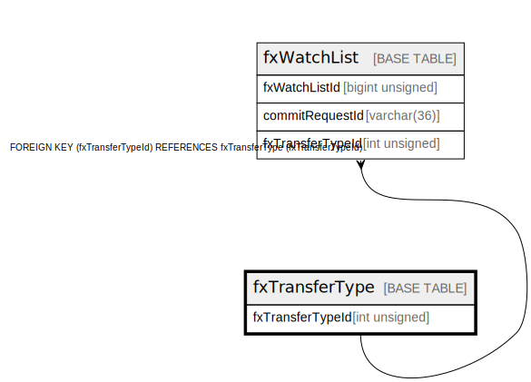

# fxTransferType

## Description

<details>
<summary><strong>Table Definition</strong></summary>

```sql
CREATE TABLE `fxTransferType` (
  `fxTransferTypeId` int unsigned NOT NULL AUTO_INCREMENT,
  `name` varchar(50) NOT NULL,
  `description` varchar(512) DEFAULT NULL,
  `createdDate` datetime NOT NULL DEFAULT CURRENT_TIMESTAMP,
  PRIMARY KEY (`fxTransferTypeId`),
  UNIQUE KEY `fxtransfertype_name_unique` (`name`)
) ENGINE=InnoDB AUTO_INCREMENT=[Redacted by tbls] DEFAULT CHARSET=utf8mb4 COLLATE=utf8mb4_0900_ai_ci
```

</details>

## Columns

| Name             | Type         | Default           | Nullable | Extra Definition  | Children                      |
| ---------------- | ------------ | ----------------- | -------- | ----------------- | ----------------------------- |
| fxTransferTypeId | int unsigned |                   | false    | auto_increment    | [fxWatchList](fxWatchList.md) |
| name             | varchar(50)  |                   | false    |                   |                               |
| description      | varchar(512) |                   | true     |                   |                               |
| createdDate      | datetime     | CURRENT_TIMESTAMP | false    | DEFAULT_GENERATED |                               |

## Constraints

| Name                       | Type        | Definition                                   |
| -------------------------- | ----------- | -------------------------------------------- |
| fxtransfertype_name_unique | UNIQUE      | UNIQUE KEY fxtransfertype_name_unique (name) |
| PRIMARY                    | PRIMARY KEY | PRIMARY KEY (fxTransferTypeId)               |

## Indexes

| Name                       | Definition                                               |
| -------------------------- | -------------------------------------------------------- |
| PRIMARY                    | PRIMARY KEY (fxTransferTypeId) USING BTREE               |
| fxtransfertype_name_unique | UNIQUE KEY fxtransfertype_name_unique (name) USING BTREE |

## Relations



---

> Generated by [tbls](https://github.com/k1LoW/tbls)
