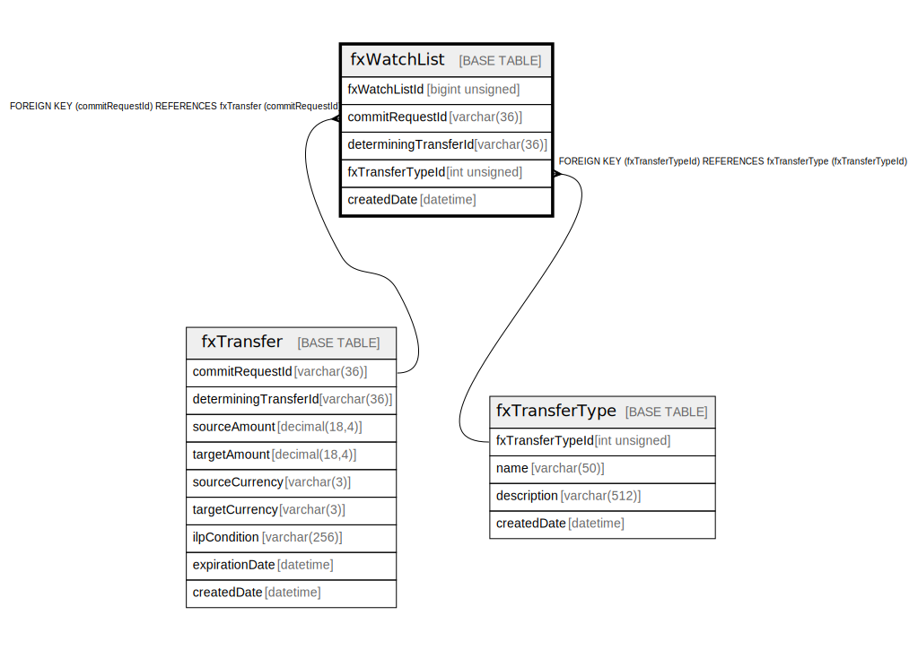

# fxWatchList

## Description

<details>
<summary><strong>Table Definition</strong></summary>

```sql
CREATE TABLE `fxWatchList` (
  `fxWatchListId` bigint unsigned NOT NULL AUTO_INCREMENT,
  `commitRequestId` varchar(36) NOT NULL,
  `determiningTransferId` varchar(36) NOT NULL,
  `fxTransferTypeId` int unsigned NOT NULL,
  `createdDate` datetime NOT NULL DEFAULT CURRENT_TIMESTAMP,
  PRIMARY KEY (`fxWatchListId`),
  KEY `fxwatchlist_fxtransfertypeid_foreign` (`fxTransferTypeId`),
  KEY `fxwatchlist_commitrequestid_index` (`commitRequestId`),
  KEY `fxwatchlist_determiningtransferid_index` (`determiningTransferId`),
  CONSTRAINT `fxwatchlist_commitrequestid_foreign` FOREIGN KEY (`commitRequestId`) REFERENCES `fxTransfer` (`commitRequestId`),
  CONSTRAINT `fxwatchlist_fxtransfertypeid_foreign` FOREIGN KEY (`fxTransferTypeId`) REFERENCES `fxTransferType` (`fxTransferTypeId`)
) ENGINE=InnoDB DEFAULT CHARSET=utf8mb4 COLLATE=utf8mb4_0900_ai_ci
```

</details>

## Columns

| Name | Type | Default | Nullable | Extra Definition | Children | Parents | Comment |
| ---- | ---- | ------- | -------- | ---------------- | -------- | ------- | ------- |
| fxWatchListId | bigint unsigned |  | false | auto_increment |  |  |  |
| commitRequestId | varchar(36) |  | false |  |  | [fxTransfer](fxTransfer.md) |  |
| determiningTransferId | varchar(36) |  | false |  |  |  |  |
| fxTransferTypeId | int unsigned |  | false |  |  | [fxTransferType](fxTransferType.md) |  |
| createdDate | datetime | CURRENT_TIMESTAMP | false | DEFAULT_GENERATED |  |  |  |

## Constraints

| Name | Type | Definition |
| ---- | ---- | ---------- |
| fxwatchlist_commitrequestid_foreign | FOREIGN KEY | FOREIGN KEY (commitRequestId) REFERENCES fxTransfer (commitRequestId) |
| fxwatchlist_fxtransfertypeid_foreign | FOREIGN KEY | FOREIGN KEY (fxTransferTypeId) REFERENCES fxTransferType (fxTransferTypeId) |
| PRIMARY | PRIMARY KEY | PRIMARY KEY (fxWatchListId) |

## Indexes

| Name | Definition |
| ---- | ---------- |
| fxwatchlist_commitrequestid_index | KEY fxwatchlist_commitrequestid_index (commitRequestId) USING BTREE |
| fxwatchlist_determiningtransferid_index | KEY fxwatchlist_determiningtransferid_index (determiningTransferId) USING BTREE |
| fxwatchlist_fxtransfertypeid_foreign | KEY fxwatchlist_fxtransfertypeid_foreign (fxTransferTypeId) USING BTREE |
| PRIMARY | PRIMARY KEY (fxWatchListId) USING BTREE |

## Relations



---

> Generated by [tbls](https://github.com/k1LoW/tbls)
