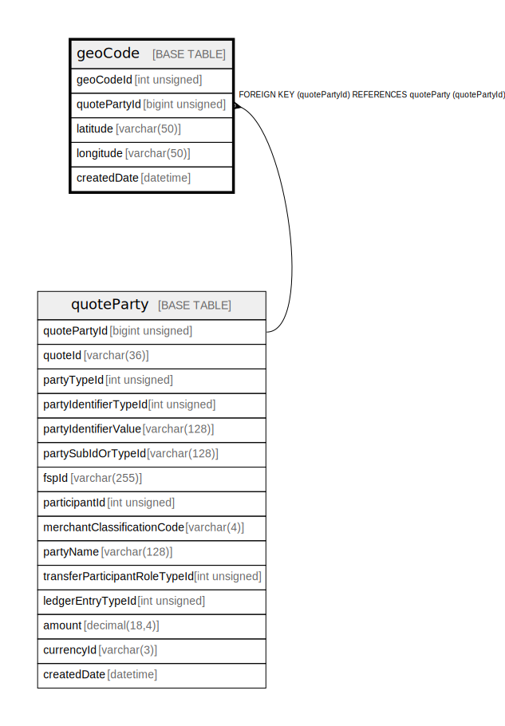

# geoCode

## Description

<details>
<summary><strong>Table Definition</strong></summary>

```sql
CREATE TABLE `geoCode` (
  `geoCodeId` int unsigned NOT NULL AUTO_INCREMENT,
  `quotePartyId` bigint unsigned NOT NULL COMMENT 'Optionally the GeoCode for the Payer/Payee may have been provided. If the Quote Response has the GeoCode for the Payee, an additional row is added',
  `latitude` varchar(50) NOT NULL COMMENT 'Latitude of the initiating Party',
  `longitude` varchar(50) NOT NULL COMMENT 'Longitude of the initiating Party',
  `createdDate` datetime NOT NULL DEFAULT CURRENT_TIMESTAMP COMMENT 'System dateTime stamp pertaining to the inserted record',
  PRIMARY KEY (`geoCodeId`),
  KEY `geocode_quotepartyid_foreign` (`quotePartyId`),
  CONSTRAINT `geocode_quotepartyid_foreign` FOREIGN KEY (`quotePartyId`) REFERENCES `quoteParty` (`quotePartyId`)
) ENGINE=InnoDB DEFAULT CHARSET=utf8mb4 COLLATE=utf8mb4_0900_ai_ci
```

</details>

## Columns

| Name | Type | Default | Nullable | Extra Definition | Children | Parents | Comment |
| ---- | ---- | ------- | -------- | ---------------- | -------- | ------- | ------- |
| geoCodeId | int unsigned |  | false | auto_increment |  |  |  |
| quotePartyId | bigint unsigned |  | false |  |  | [quoteParty](quoteParty.md) | Optionally the GeoCode for the Payer/Payee may have been provided. If the Quote Response has the GeoCode for the Payee, an additional row is added |
| latitude | varchar(50) |  | false |  |  |  | Latitude of the initiating Party |
| longitude | varchar(50) |  | false |  |  |  | Longitude of the initiating Party |
| createdDate | datetime | CURRENT_TIMESTAMP | false | DEFAULT_GENERATED |  |  | System dateTime stamp pertaining to the inserted record |

## Constraints

| Name | Type | Definition |
| ---- | ---- | ---------- |
| geocode_quotepartyid_foreign | FOREIGN KEY | FOREIGN KEY (quotePartyId) REFERENCES quoteParty (quotePartyId) |
| PRIMARY | PRIMARY KEY | PRIMARY KEY (geoCodeId) |

## Indexes

| Name | Definition |
| ---- | ---------- |
| geocode_quotepartyid_foreign | KEY geocode_quotepartyid_foreign (quotePartyId) USING BTREE |
| PRIMARY | PRIMARY KEY (geoCodeId) USING BTREE |

## Relations



---

> Generated by [tbls](https://github.com/k1LoW/tbls)
