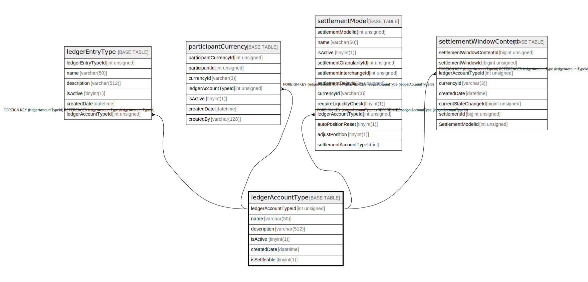

# ledgerAccountType

## Description

<details>
<summary><strong>Table Definition</strong></summary>

```sql
CREATE TABLE `ledgerAccountType` (
  `ledgerAccountTypeId` int unsigned NOT NULL AUTO_INCREMENT,
  `name` varchar(50) NOT NULL,
  `description` varchar(512) DEFAULT NULL,
  `isActive` tinyint(1) NOT NULL DEFAULT '1',
  `createdDate` datetime NOT NULL DEFAULT CURRENT_TIMESTAMP,
  `isSettleable` tinyint(1) NOT NULL DEFAULT '0',
  PRIMARY KEY (`ledgerAccountTypeId`),
  UNIQUE KEY `ledgeraccounttype_name_unique` (`name`)
) ENGINE=InnoDB AUTO_INCREMENT=[Redacted by tbls] DEFAULT CHARSET=utf8mb4 COLLATE=utf8mb4_0900_ai_ci
```

</details>

## Columns

| Name                | Type         | Default           | Nullable | Extra Definition  | Children                                                                                                                                                                        |
| ------------------- | ------------ | ----------------- | -------- | ----------------- | ------------------------------------------------------------------------------------------------------------------------------------------------------------------------------- |
| ledgerAccountTypeId | int unsigned |                   | false    | auto_increment    | [ledgerEntryType](ledgerEntryType.md) [participantCurrency](participantCurrency.md) [settlementModel](settlementModel.md) [settlementWindowContent](settlementWindowContent.md) |
| name                | varchar(50)  |                   | false    |                   |                                                                                                                                                                                 |
| description         | varchar(512) |                   | true     |                   |                                                                                                                                                                                 |
| isActive            | tinyint(1)   | 1                 | false    |                   |                                                                                                                                                                                 |
| createdDate         | datetime     | CURRENT_TIMESTAMP | false    | DEFAULT_GENERATED |                                                                                                                                                                                 |
| isSettleable        | tinyint(1)   | 0                 | false    |                   |                                                                                                                                                                                 |

## Constraints

| Name                          | Type        | Definition                                      |
| ----------------------------- | ----------- | ----------------------------------------------- |
| ledgeraccounttype_name_unique | UNIQUE      | UNIQUE KEY ledgeraccounttype_name_unique (name) |
| PRIMARY                       | PRIMARY KEY | PRIMARY KEY (ledgerAccountTypeId)               |

## Indexes

| Name                          | Definition                                                  |
| ----------------------------- | ----------------------------------------------------------- |
| PRIMARY                       | PRIMARY KEY (ledgerAccountTypeId) USING BTREE               |
| ledgeraccounttype_name_unique | UNIQUE KEY ledgeraccounttype_name_unique (name) USING BTREE |

## Relations



---

> Generated by [tbls](https://github.com/k1LoW/tbls)
