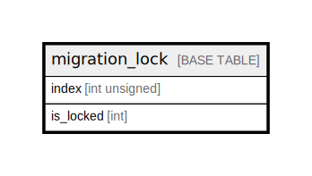

# migration_lock

## Description

<details>
<summary><strong>Table Definition</strong></summary>

```sql
CREATE TABLE `migration_lock` (
  `index` int unsigned NOT NULL AUTO_INCREMENT,
  `is_locked` int DEFAULT NULL,
  PRIMARY KEY (`index`)
) ENGINE=InnoDB AUTO_INCREMENT=[Redacted by tbls] DEFAULT CHARSET=utf8mb4 COLLATE=utf8mb4_0900_ai_ci
```

</details>

## Columns

| Name | Type | Default | Nullable | Extra Definition | Children | Parents | Comment |
| ---- | ---- | ------- | -------- | ---------------- | -------- | ------- | ------- |
| index | int unsigned |  | false | auto_increment |  |  |  |
| is_locked | int |  | true |  |  |  |  |

## Constraints

| Name | Type | Definition |
| ---- | ---- | ---------- |
| PRIMARY | PRIMARY KEY | PRIMARY KEY (index) |

## Indexes

| Name | Definition |
| ---- | ---------- |
| PRIMARY | PRIMARY KEY (index) USING BTREE |

## Relations



---

> Generated by [tbls](https://github.com/k1LoW/tbls)
