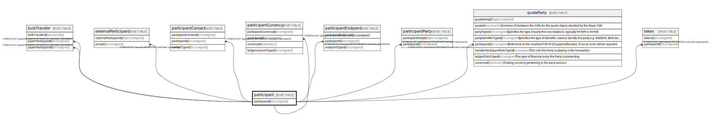

# participant

## Description

<details>
<summary><strong>Table Definition</strong></summary>

```sql
CREATE TABLE `participant` (
  `participantId` int unsigned NOT NULL AUTO_INCREMENT,
  `name` varchar(256) NOT NULL,
  `description` varchar(512) DEFAULT NULL,
  `isActive` tinyint(1) NOT NULL DEFAULT '1',
  `createdDate` datetime NOT NULL DEFAULT CURRENT_TIMESTAMP,
  `createdBy` varchar(128) NOT NULL,
  `isProxy` tinyint(1) NOT NULL DEFAULT '0',
  PRIMARY KEY (`participantId`),
  UNIQUE KEY `participant_name_unique` (`name`)
) ENGINE=InnoDB AUTO_INCREMENT=[Redacted by tbls] DEFAULT CHARSET=utf8mb4 COLLATE=utf8mb4_0900_ai_ci
```

</details>

## Columns

| Name | Type | Default | Nullable | Extra Definition | Children | Parents | Comment |
| ---- | ---- | ------- | -------- | ---------------- | -------- | ------- | ------- |
| participantId | int unsigned |  | false | auto_increment | [bulkTransfer](bulkTransfer.md) [externalParticipant](externalParticipant.md) [participantContact](participantContact.md) [participantCurrency](participantCurrency.md) [participantEndpoint](participantEndpoint.md) [participantParty](participantParty.md) [quoteParty](quoteParty.md) [token](token.md) |  |  |
| name | varchar(256) |  | false |  |  |  |  |
| description | varchar(512) |  | true |  |  |  |  |
| isActive | tinyint(1) | 1 | false |  |  |  |  |
| createdDate | datetime | CURRENT_TIMESTAMP | false | DEFAULT_GENERATED |  |  |  |
| createdBy | varchar(128) |  | false |  |  |  |  |
| isProxy | tinyint(1) | 0 | false |  |  |  |  |

## Constraints

| Name | Type | Definition |
| ---- | ---- | ---------- |
| participant_name_unique | UNIQUE | UNIQUE KEY participant_name_unique (name) |
| PRIMARY | PRIMARY KEY | PRIMARY KEY (participantId) |

## Indexes

| Name | Definition |
| ---- | ---------- |
| PRIMARY | PRIMARY KEY (participantId) USING BTREE |
| participant_name_unique | UNIQUE KEY participant_name_unique (name) USING BTREE |

## Relations



---

> Generated by [tbls](https://github.com/k1LoW/tbls)
