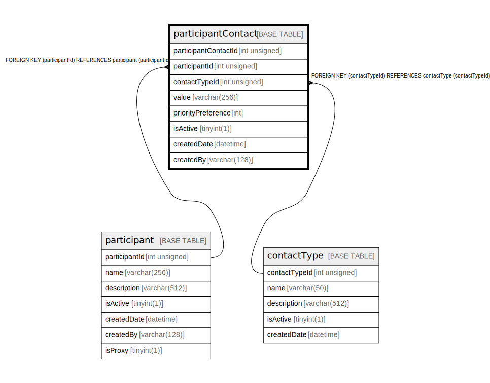

# participantContact

## Description

<details>
<summary><strong>Table Definition</strong></summary>

```sql
CREATE TABLE `participantContact` (
  `participantContactId` int unsigned NOT NULL AUTO_INCREMENT,
  `participantId` int unsigned NOT NULL,
  `contactTypeId` int unsigned NOT NULL,
  `value` varchar(256) NOT NULL,
  `priorityPreference` int NOT NULL DEFAULT '9',
  `isActive` tinyint(1) NOT NULL DEFAULT '1',
  `createdDate` datetime NOT NULL DEFAULT CURRENT_TIMESTAMP,
  `createdBy` varchar(128) NOT NULL,
  PRIMARY KEY (`participantContactId`),
  KEY `participantcontact_participantid_index` (`participantId`),
  KEY `participantcontact_contacttypeid_index` (`contactTypeId`),
  CONSTRAINT `participantcontact_contacttypeid_foreign` FOREIGN KEY (`contactTypeId`) REFERENCES `contactType` (`contactTypeId`),
  CONSTRAINT `participantcontact_participantid_foreign` FOREIGN KEY (`participantId`) REFERENCES `participant` (`participantId`)
) ENGINE=InnoDB DEFAULT CHARSET=utf8mb4 COLLATE=utf8mb4_0900_ai_ci
```

</details>

## Columns

| Name                 | Type         | Default           | Nullable | Extra Definition  | Parents                       |
| -------------------- | ------------ | ----------------- | -------- | ----------------- | ----------------------------- |
| participantContactId | int unsigned |                   | false    | auto_increment    |                               |
| participantId        | int unsigned |                   | false    |                   | [participant](participant.md) |
| contactTypeId        | int unsigned |                   | false    |                   | [contactType](contactType.md) |
| value                | varchar(256) |                   | false    |                   |                               |
| priorityPreference   | int          | 9                 | false    |                   |                               |
| isActive             | tinyint(1)   | 1                 | false    |                   |                               |
| createdDate          | datetime     | CURRENT_TIMESTAMP | false    | DEFAULT_GENERATED |                               |
| createdBy            | varchar(128) |                   | false    |                   |                               |

## Constraints

| Name                                     | Type        | Definition                                                         |
| ---------------------------------------- | ----------- | ------------------------------------------------------------------ |
| participantcontact_contacttypeid_foreign | FOREIGN KEY | FOREIGN KEY (contactTypeId) REFERENCES contactType (contactTypeId) |
| participantcontact_participantid_foreign | FOREIGN KEY | FOREIGN KEY (participantId) REFERENCES participant (participantId) |
| PRIMARY                                  | PRIMARY KEY | PRIMARY KEY (participantContactId)                                 |

## Indexes

| Name                                   | Definition                                                             |
| -------------------------------------- | ---------------------------------------------------------------------- |
| participantcontact_contacttypeid_index | KEY participantcontact_contacttypeid_index (contactTypeId) USING BTREE |
| participantcontact_participantid_index | KEY participantcontact_participantid_index (participantId) USING BTREE |
| PRIMARY                                | PRIMARY KEY (participantContactId) USING BTREE                         |

## Relations



---

> Generated by [tbls](https://github.com/k1LoW/tbls)
