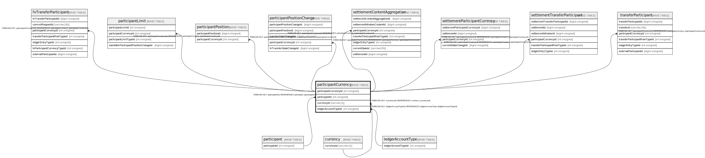

# participantCurrency

## Description

<details>
<summary><strong>Table Definition</strong></summary>

```sql
CREATE TABLE `participantCurrency` (
  `participantCurrencyId` int unsigned NOT NULL AUTO_INCREMENT,
  `participantId` int unsigned NOT NULL,
  `currencyId` varchar(3) NOT NULL,
  `ledgerAccountTypeId` int unsigned NOT NULL,
  `isActive` tinyint(1) NOT NULL DEFAULT '1',
  `createdDate` datetime NOT NULL DEFAULT CURRENT_TIMESTAMP,
  `createdBy` varchar(128) NOT NULL,
  PRIMARY KEY (`participantCurrencyId`),
  UNIQUE KEY `participantcurrency_pcl_unique` (`participantId`,`currencyId`,`ledgerAccountTypeId`),
  KEY `participantcurrency_ledgeraccounttypeid_foreign` (`ledgerAccountTypeId`),
  KEY `participantcurrency_participantid_index` (`participantId`),
  KEY `participantcurrency_currencyid_index` (`currencyId`),
  CONSTRAINT `participantcurrency_currencyid_foreign` FOREIGN KEY (`currencyId`) REFERENCES `currency` (`currencyId`),
  CONSTRAINT `participantcurrency_ledgeraccounttypeid_foreign` FOREIGN KEY (`ledgerAccountTypeId`) REFERENCES `ledgerAccountType` (`ledgerAccountTypeId`),
  CONSTRAINT `participantcurrency_participantid_foreign` FOREIGN KEY (`participantId`) REFERENCES `participant` (`participantId`)
) ENGINE=InnoDB DEFAULT CHARSET=utf8mb4 COLLATE=utf8mb4_0900_ai_ci
```

</details>

## Columns

| Name | Type | Default | Nullable | Extra Definition | Children | Parents | Comment |
| ---- | ---- | ------- | -------- | ---------------- | -------- | ------- | ------- |
| participantCurrencyId | int unsigned |  | false | auto_increment | [fxTransferParticipant](fxTransferParticipant.md) [participantLimit](participantLimit.md) [participantPosition](participantPosition.md) [participantPositionChange](participantPositionChange.md) [settlementContentAggregation](settlementContentAggregation.md) [settlementParticipantCurrency](settlementParticipantCurrency.md) [settlementTransferParticipant](settlementTransferParticipant.md) [transferParticipant](transferParticipant.md) |  |  |
| participantId | int unsigned |  | false |  |  | [participant](participant.md) |  |
| currencyId | varchar(3) |  | false |  |  | [currency](currency.md) |  |
| ledgerAccountTypeId | int unsigned |  | false |  |  | [ledgerAccountType](ledgerAccountType.md) |  |
| isActive | tinyint(1) | 1 | false |  |  |  |  |
| createdDate | datetime | CURRENT_TIMESTAMP | false | DEFAULT_GENERATED |  |  |  |
| createdBy | varchar(128) |  | false |  |  |  |  |

## Constraints

| Name | Type | Definition |
| ---- | ---- | ---------- |
| participantcurrency_currencyid_foreign | FOREIGN KEY | FOREIGN KEY (currencyId) REFERENCES currency (currencyId) |
| participantcurrency_ledgeraccounttypeid_foreign | FOREIGN KEY | FOREIGN KEY (ledgerAccountTypeId) REFERENCES ledgerAccountType (ledgerAccountTypeId) |
| participantcurrency_participantid_foreign | FOREIGN KEY | FOREIGN KEY (participantId) REFERENCES participant (participantId) |
| participantcurrency_pcl_unique | UNIQUE | UNIQUE KEY participantcurrency_pcl_unique (participantId, currencyId, ledgerAccountTypeId) |
| PRIMARY | PRIMARY KEY | PRIMARY KEY (participantCurrencyId) |

## Indexes

| Name | Definition |
| ---- | ---------- |
| participantcurrency_currencyid_index | KEY participantcurrency_currencyid_index (currencyId) USING BTREE |
| participantcurrency_ledgeraccounttypeid_foreign | KEY participantcurrency_ledgeraccounttypeid_foreign (ledgerAccountTypeId) USING BTREE |
| participantcurrency_participantid_index | KEY participantcurrency_participantid_index (participantId) USING BTREE |
| PRIMARY | PRIMARY KEY (participantCurrencyId) USING BTREE |
| participantcurrency_pcl_unique | UNIQUE KEY participantcurrency_pcl_unique (participantId, currencyId, ledgerAccountTypeId) USING BTREE |

## Relations



---

> Generated by [tbls](https://github.com/k1LoW/tbls)
