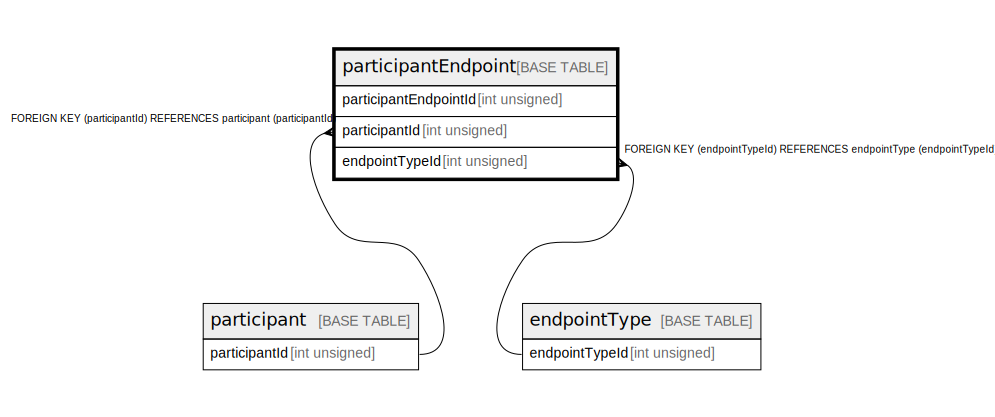

# participantEndpoint

## Description

<details>
<summary><strong>Table Definition</strong></summary>

```sql
CREATE TABLE `participantEndpoint` (
  `participantEndpointId` int unsigned NOT NULL AUTO_INCREMENT,
  `participantId` int unsigned NOT NULL,
  `endpointTypeId` int unsigned NOT NULL,
  `value` varchar(512) NOT NULL,
  `isActive` tinyint(1) NOT NULL DEFAULT '1',
  `createdDate` datetime NOT NULL DEFAULT CURRENT_TIMESTAMP,
  `createdBy` varchar(128) NOT NULL,
  PRIMARY KEY (`participantEndpointId`),
  UNIQUE KEY `participantendpoint_participantid_endpointtypeid_unique` (`participantId`,`endpointTypeId`),
  KEY `participantendpoint_participantid_index` (`participantId`),
  KEY `participantendpoint_endpointtypeid_index` (`endpointTypeId`),
  CONSTRAINT `participantendpoint_endpointtypeid_foreign` FOREIGN KEY (`endpointTypeId`) REFERENCES `endpointType` (`endpointTypeId`),
  CONSTRAINT `participantendpoint_participantid_foreign` FOREIGN KEY (`participantId`) REFERENCES `participant` (`participantId`)
) ENGINE=InnoDB DEFAULT CHARSET=utf8mb4 COLLATE=utf8mb4_0900_ai_ci
```

</details>

## Columns

| Name                  | Type         | Default           | Nullable | Extra Definition  | Parents                         |
| --------------------- | ------------ | ----------------- | -------- | ----------------- | ------------------------------- |
| participantEndpointId | int unsigned |                   | false    | auto_increment    |                                 |
| participantId         | int unsigned |                   | false    |                   | [participant](participant.md)   |
| endpointTypeId        | int unsigned |                   | false    |                   | [endpointType](endpointType.md) |
| value                 | varchar(512) |                   | false    |                   |                                 |
| isActive              | tinyint(1)   | 1                 | false    |                   |                                 |
| createdDate           | datetime     | CURRENT_TIMESTAMP | false    | DEFAULT_GENERATED |                                 |
| createdBy             | varchar(128) |                   | false    |                   |                                 |

## Constraints

| Name                                                    | Type        | Definition                                                                                         |
| ------------------------------------------------------- | ----------- | -------------------------------------------------------------------------------------------------- |
| participantendpoint_endpointtypeid_foreign              | FOREIGN KEY | FOREIGN KEY (endpointTypeId) REFERENCES endpointType (endpointTypeId)                              |
| participantendpoint_participantid_endpointtypeid_unique | UNIQUE      | UNIQUE KEY participantendpoint_participantid_endpointtypeid_unique (participantId, endpointTypeId) |
| participantendpoint_participantid_foreign               | FOREIGN KEY | FOREIGN KEY (participantId) REFERENCES participant (participantId)                                 |
| PRIMARY                                                 | PRIMARY KEY | PRIMARY KEY (participantEndpointId)                                                                |

## Indexes

| Name                                                    | Definition                                                                                                     |
| ------------------------------------------------------- | -------------------------------------------------------------------------------------------------------------- |
| participantendpoint_endpointtypeid_index                | KEY participantendpoint_endpointtypeid_index (endpointTypeId) USING BTREE                                      |
| participantendpoint_participantid_index                 | KEY participantendpoint_participantid_index (participantId) USING BTREE                                        |
| PRIMARY                                                 | PRIMARY KEY (participantEndpointId) USING BTREE                                                                |
| participantendpoint_participantid_endpointtypeid_unique | UNIQUE KEY participantendpoint_participantid_endpointtypeid_unique (participantId, endpointTypeId) USING BTREE |

## Relations



---

> Generated by [tbls](https://github.com/k1LoW/tbls)
