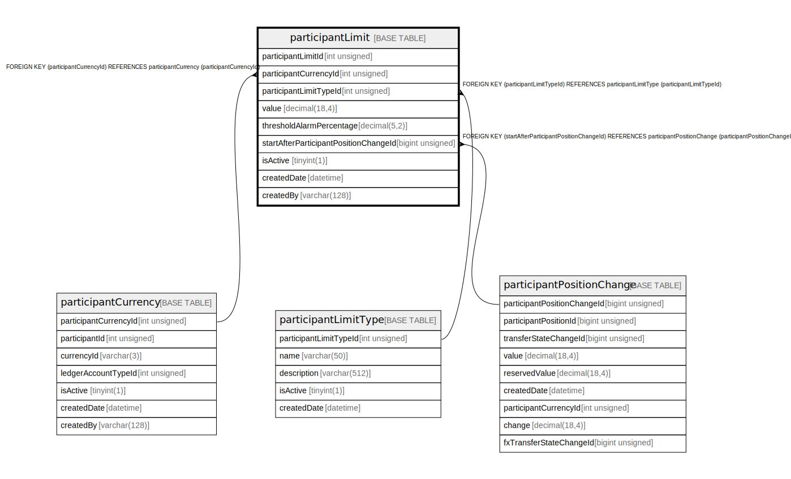

# participantLimit

## Description

<details>
<summary><strong>Table Definition</strong></summary>

```sql
CREATE TABLE `participantLimit` (
  `participantLimitId` int unsigned NOT NULL AUTO_INCREMENT,
  `participantCurrencyId` int unsigned NOT NULL,
  `participantLimitTypeId` int unsigned NOT NULL,
  `value` decimal(18,4) NOT NULL DEFAULT '0.0000',
  `thresholdAlarmPercentage` decimal(5,2) NOT NULL DEFAULT '10.00',
  `startAfterParticipantPositionChangeId` bigint unsigned DEFAULT NULL,
  `isActive` tinyint(1) NOT NULL DEFAULT '1',
  `createdDate` datetime NOT NULL DEFAULT CURRENT_TIMESTAMP,
  `createdBy` varchar(128) NOT NULL,
  PRIMARY KEY (`participantLimitId`),
  UNIQUE KEY `participantLimit_unique_idx` (`participantCurrencyId`,`participantLimitTypeId`,`isActive`,`participantLimitId`),
  KEY `participantlimit_participantcurrencyid_index` (`participantCurrencyId`),
  KEY `participantlimit_participantlimittypeid_index` (`participantLimitTypeId`),
  KEY `participantlimit_startafterparticipantpositionchangeid_index` (`startAfterParticipantPositionChangeId`),
  CONSTRAINT `participantlimit_participantcurrencyid_foreign` FOREIGN KEY (`participantCurrencyId`) REFERENCES `participantCurrency` (`participantCurrencyId`),
  CONSTRAINT `participantlimit_participantlimittypeid_foreign` FOREIGN KEY (`participantLimitTypeId`) REFERENCES `participantLimitType` (`participantLimitTypeId`),
  CONSTRAINT `participantlimit_startafterparticipantpositionchangeid_foreign` FOREIGN KEY (`startAfterParticipantPositionChangeId`) REFERENCES `participantPositionChange` (`participantPositionChangeId`)
) ENGINE=InnoDB DEFAULT CHARSET=utf8mb4 COLLATE=utf8mb4_0900_ai_ci
```

</details>

## Columns

| Name                                  | Type            | Default           | Nullable | Extra Definition  | Parents                                                   |
| ------------------------------------- | --------------- | ----------------- | -------- | ----------------- | --------------------------------------------------------- |
| participantLimitId                    | int unsigned    |                   | false    | auto_increment    |                                                           |
| participantCurrencyId                 | int unsigned    |                   | false    |                   | [participantCurrency](participantCurrency.md)             |
| participantLimitTypeId                | int unsigned    |                   | false    |                   | [participantLimitType](participantLimitType.md)           |
| value                                 | decimal(18,4)   | 0.0000            | false    |                   |                                                           |
| thresholdAlarmPercentage              | decimal(5,2)    | 10.00             | false    |                   |                                                           |
| startAfterParticipantPositionChangeId | bigint unsigned |                   | true     |                   | [participantPositionChange](participantPositionChange.md) |
| isActive                              | tinyint(1)      | 1                 | false    |                   |                                                           |
| createdDate                           | datetime        | CURRENT_TIMESTAMP | false    | DEFAULT_GENERATED |                                                           |
| createdBy                             | varchar(128)    |                   | false    |                   |                                                           |

## Constraints

| Name                                                           | Type        | Definition                                                                                                             |
| -------------------------------------------------------------- | ----------- | ---------------------------------------------------------------------------------------------------------------------- |
| participantlimit_participantcurrencyid_foreign                 | FOREIGN KEY | FOREIGN KEY (participantCurrencyId) REFERENCES participantCurrency (participantCurrencyId)                             |
| participantlimit_participantlimittypeid_foreign                | FOREIGN KEY | FOREIGN KEY (participantLimitTypeId) REFERENCES participantLimitType (participantLimitTypeId)                          |
| participantlimit_startafterparticipantpositionchangeid_foreign | FOREIGN KEY | FOREIGN KEY (startAfterParticipantPositionChangeId) REFERENCES participantPositionChange (participantPositionChangeId) |
| participantLimit_unique_idx                                    | UNIQUE      | UNIQUE KEY participantLimit_unique_idx (participantCurrencyId, participantLimitTypeId, isActive, participantLimitId)   |
| PRIMARY                                                        | PRIMARY KEY | PRIMARY KEY (participantLimitId)                                                                                       |

## Indexes

| Name                                                         | Definition                                                                                                                       |
| ------------------------------------------------------------ | -------------------------------------------------------------------------------------------------------------------------------- |
| participantlimit_participantcurrencyid_index                 | KEY participantlimit_participantcurrencyid_index (participantCurrencyId) USING BTREE                                             |
| participantlimit_participantlimittypeid_index                | KEY participantlimit_participantlimittypeid_index (participantLimitTypeId) USING BTREE                                           |
| participantlimit_startafterparticipantpositionchangeid_index | KEY participantlimit_startafterparticipantpositionchangeid_index (startAfterParticipantPositionChangeId) USING BTREE             |
| PRIMARY                                                      | PRIMARY KEY (participantLimitId) USING BTREE                                                                                     |
| participantLimit_unique_idx                                  | UNIQUE KEY participantLimit_unique_idx (participantCurrencyId, participantLimitTypeId, isActive, participantLimitId) USING BTREE |

## Relations



---

> Generated by [tbls](https://github.com/k1LoW/tbls)
