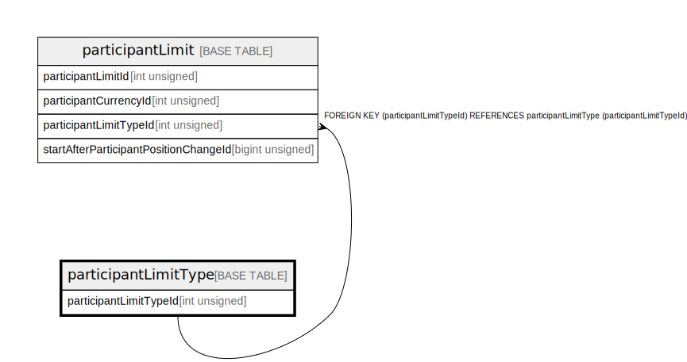

# participantLimitType

## Description

<details>
<summary><strong>Table Definition</strong></summary>

```sql
CREATE TABLE `participantLimitType` (
  `participantLimitTypeId` int unsigned NOT NULL AUTO_INCREMENT,
  `name` varchar(50) NOT NULL,
  `description` varchar(512) DEFAULT NULL,
  `isActive` tinyint(1) NOT NULL DEFAULT '1',
  `createdDate` datetime NOT NULL DEFAULT CURRENT_TIMESTAMP,
  PRIMARY KEY (`participantLimitTypeId`),
  UNIQUE KEY `participantlimittype_name_unique` (`name`)
) ENGINE=InnoDB AUTO_INCREMENT=[Redacted by tbls] DEFAULT CHARSET=utf8mb4 COLLATE=utf8mb4_0900_ai_ci
```

</details>

## Columns

| Name                   | Type         | Default           | Nullable | Extra Definition  | Children                                |
| ---------------------- | ------------ | ----------------- | -------- | ----------------- | --------------------------------------- |
| participantLimitTypeId | int unsigned |                   | false    | auto_increment    | [participantLimit](participantLimit.md) |
| name                   | varchar(50)  |                   | false    |                   |                                         |
| description            | varchar(512) |                   | true     |                   |                                         |
| isActive               | tinyint(1)   | 1                 | false    |                   |                                         |
| createdDate            | datetime     | CURRENT_TIMESTAMP | false    | DEFAULT_GENERATED |                                         |

## Constraints

| Name                             | Type        | Definition                                         |
| -------------------------------- | ----------- | -------------------------------------------------- |
| participantlimittype_name_unique | UNIQUE      | UNIQUE KEY participantlimittype_name_unique (name) |
| PRIMARY                          | PRIMARY KEY | PRIMARY KEY (participantLimitTypeId)               |

## Indexes

| Name                             | Definition                                                     |
| -------------------------------- | -------------------------------------------------------------- |
| PRIMARY                          | PRIMARY KEY (participantLimitTypeId) USING BTREE               |
| participantlimittype_name_unique | UNIQUE KEY participantlimittype_name_unique (name) USING BTREE |

## Relations



---

> Generated by [tbls](https://github.com/k1LoW/tbls)
