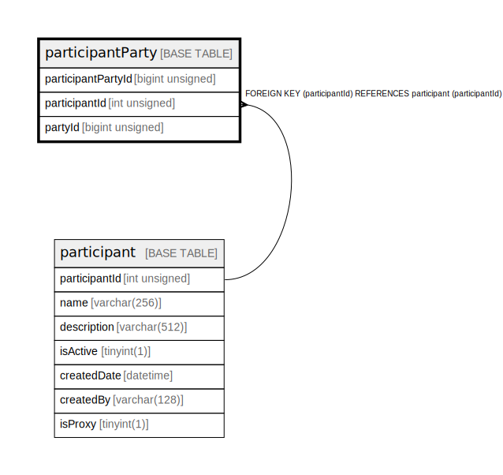

# participantParty

## Description

<details>
<summary><strong>Table Definition</strong></summary>

```sql
CREATE TABLE `participantParty` (
  `participantPartyId` bigint unsigned NOT NULL AUTO_INCREMENT,
  `participantId` int unsigned NOT NULL,
  `partyId` bigint unsigned NOT NULL,
  PRIMARY KEY (`participantPartyId`),
  UNIQUE KEY `participantparty_participantid_partyid_unique` (`participantId`,`partyId`),
  KEY `participantparty_participantid_index` (`participantId`),
  CONSTRAINT `participantparty_participantid_foreign` FOREIGN KEY (`participantId`) REFERENCES `participant` (`participantId`)
) ENGINE=InnoDB DEFAULT CHARSET=utf8mb4 COLLATE=utf8mb4_0900_ai_ci
```

</details>

## Columns

| Name               | Type            | Default | Nullable | Extra Definition | Parents                       |
| ------------------ | --------------- | ------- | -------- | ---------------- | ----------------------------- |
| participantPartyId | bigint unsigned |         | false    | auto_increment   |                               |
| participantId      | int unsigned    |         | false    |                  | [participant](participant.md) |
| partyId            | bigint unsigned |         | false    |                  |                               |

## Constraints

| Name                                          | Type        | Definition                                                                        |
| --------------------------------------------- | ----------- | --------------------------------------------------------------------------------- |
| participantparty_participantid_foreign        | FOREIGN KEY | FOREIGN KEY (participantId) REFERENCES participant (participantId)                |
| participantparty_participantid_partyid_unique | UNIQUE      | UNIQUE KEY participantparty_participantid_partyid_unique (participantId, partyId) |
| PRIMARY                                       | PRIMARY KEY | PRIMARY KEY (participantPartyId)                                                  |

## Indexes

| Name                                          | Definition                                                                                    |
| --------------------------------------------- | --------------------------------------------------------------------------------------------- |
| participantparty_participantid_index          | KEY participantparty_participantid_index (participantId) USING BTREE                          |
| PRIMARY                                       | PRIMARY KEY (participantPartyId) USING BTREE                                                  |
| participantparty_participantid_partyid_unique | UNIQUE KEY participantparty_participantid_partyid_unique (participantId, partyId) USING BTREE |

## Relations



---

> Generated by [tbls](https://github.com/k1LoW/tbls)
