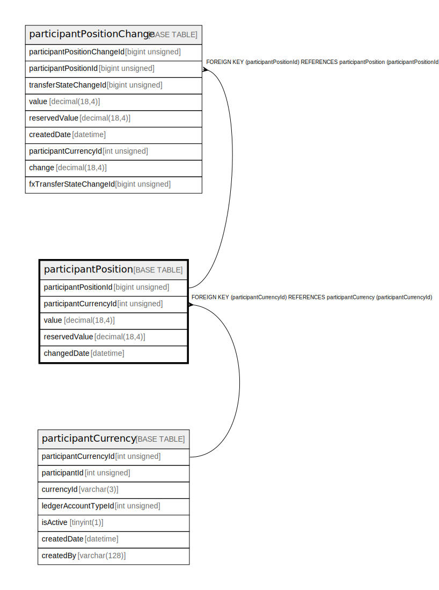

# participantPosition

## Description

<details>
<summary><strong>Table Definition</strong></summary>

```sql
CREATE TABLE `participantPosition` (
  `participantPositionId` bigint unsigned NOT NULL AUTO_INCREMENT,
  `participantCurrencyId` int unsigned NOT NULL,
  `value` decimal(18,4) NOT NULL,
  `reservedValue` decimal(18,4) NOT NULL,
  `changedDate` datetime NOT NULL DEFAULT CURRENT_TIMESTAMP,
  PRIMARY KEY (`participantPositionId`),
  KEY `participantposition_participantcurrencyid_index` (`participantCurrencyId`),
  CONSTRAINT `participantposition_participantcurrencyid_foreign` FOREIGN KEY (`participantCurrencyId`) REFERENCES `participantCurrency` (`participantCurrencyId`)
) ENGINE=InnoDB DEFAULT CHARSET=utf8mb4 COLLATE=utf8mb4_0900_ai_ci
```

</details>

## Columns

| Name                  | Type            | Default           | Nullable | Extra Definition  | Children                                                  | Parents                                       |
| --------------------- | --------------- | ----------------- | -------- | ----------------- | --------------------------------------------------------- | --------------------------------------------- |
| participantPositionId | bigint unsigned |                   | false    | auto_increment    | [participantPositionChange](participantPositionChange.md) |                                               |
| participantCurrencyId | int unsigned    |                   | false    |                   |                                                           | [participantCurrency](participantCurrency.md) |
| value                 | decimal(18,4)   |                   | false    |                   |                                                           |                                               |
| reservedValue         | decimal(18,4)   |                   | false    |                   |                                                           |                                               |
| changedDate           | datetime        | CURRENT_TIMESTAMP | false    | DEFAULT_GENERATED |                                                           |                                               |

## Constraints

| Name                                              | Type        | Definition                                                                                 |
| ------------------------------------------------- | ----------- | ------------------------------------------------------------------------------------------ |
| participantposition_participantcurrencyid_foreign | FOREIGN KEY | FOREIGN KEY (participantCurrencyId) REFERENCES participantCurrency (participantCurrencyId) |
| PRIMARY                                           | PRIMARY KEY | PRIMARY KEY (participantPositionId)                                                        |

## Indexes

| Name                                            | Definition                                                                              |
| ----------------------------------------------- | --------------------------------------------------------------------------------------- |
| participantposition_participantcurrencyid_index | KEY participantposition_participantcurrencyid_index (participantCurrencyId) USING BTREE |
| PRIMARY                                         | PRIMARY KEY (participantPositionId) USING BTREE                                         |

## Relations



---

> Generated by [tbls](https://github.com/k1LoW/tbls)
