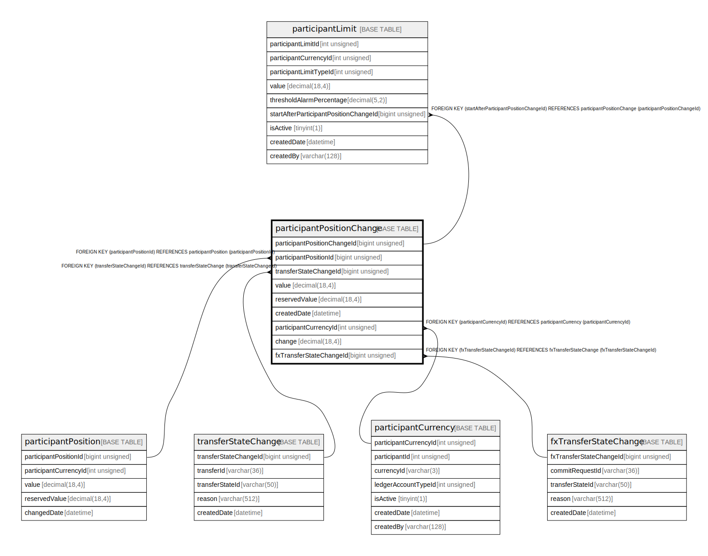

# participantPositionChange

## Description

<details>
<summary><strong>Table Definition</strong></summary>

```sql
CREATE TABLE `participantPositionChange` (
  `participantPositionChangeId` bigint unsigned NOT NULL AUTO_INCREMENT,
  `participantPositionId` bigint unsigned NOT NULL,
  `transferStateChangeId` bigint unsigned DEFAULT NULL,
  `value` decimal(18,4) NOT NULL,
  `reservedValue` decimal(18,4) NOT NULL,
  `createdDate` datetime NOT NULL DEFAULT CURRENT_TIMESTAMP,
  `participantCurrencyId` int unsigned NOT NULL,
  `change` decimal(18,4) NOT NULL,
  `fxTransferStateChangeId` bigint unsigned DEFAULT NULL,
  PRIMARY KEY (`participantPositionChangeId`),
  KEY `participantpositionchange_participantpositionid_index` (`participantPositionId`),
  KEY `participantpositionchange_transferstatechangeid_index` (`transferStateChangeId`),
  KEY `participantpositionchange_participantcurrencyid_foreign` (`participantCurrencyId`),
  KEY `participantpositionchange_fxtransferstatechangeid_foreign` (`fxTransferStateChangeId`),
  CONSTRAINT `participantpositionchange_fxtransferstatechangeid_foreign` FOREIGN KEY (`fxTransferStateChangeId`) REFERENCES `fxTransferStateChange` (`fxTransferStateChangeId`),
  CONSTRAINT `participantpositionchange_participantcurrencyid_foreign` FOREIGN KEY (`participantCurrencyId`) REFERENCES `participantCurrency` (`participantCurrencyId`),
  CONSTRAINT `participantpositionchange_participantpositionid_foreign` FOREIGN KEY (`participantPositionId`) REFERENCES `participantPosition` (`participantPositionId`),
  CONSTRAINT `participantpositionchange_transferstatechangeid_foreign` FOREIGN KEY (`transferStateChangeId`) REFERENCES `transferStateChange` (`transferStateChangeId`)
) ENGINE=InnoDB DEFAULT CHARSET=utf8mb4 COLLATE=utf8mb4_0900_ai_ci
```

</details>

## Columns

| Name | Type | Default | Nullable | Extra Definition | Children | Parents | Comment |
| ---- | ---- | ------- | -------- | ---------------- | -------- | ------- | ------- |
| participantPositionChangeId | bigint unsigned |  | false | auto_increment | [participantLimit](participantLimit.md) |  |  |
| participantPositionId | bigint unsigned |  | false |  |  | [participantPosition](participantPosition.md) |  |
| transferStateChangeId | bigint unsigned |  | true |  |  | [transferStateChange](transferStateChange.md) |  |
| value | decimal(18,4) |  | false |  |  |  |  |
| reservedValue | decimal(18,4) |  | false |  |  |  |  |
| createdDate | datetime | CURRENT_TIMESTAMP | false | DEFAULT_GENERATED |  |  |  |
| participantCurrencyId | int unsigned |  | false |  |  | [participantCurrency](participantCurrency.md) |  |
| change | decimal(18,4) |  | false |  |  |  |  |
| fxTransferStateChangeId | bigint unsigned |  | true |  |  | [fxTransferStateChange](fxTransferStateChange.md) |  |

## Constraints

| Name | Type | Definition |
| ---- | ---- | ---------- |
| participantpositionchange_fxtransferstatechangeid_foreign | FOREIGN KEY | FOREIGN KEY (fxTransferStateChangeId) REFERENCES fxTransferStateChange (fxTransferStateChangeId) |
| participantpositionchange_participantcurrencyid_foreign | FOREIGN KEY | FOREIGN KEY (participantCurrencyId) REFERENCES participantCurrency (participantCurrencyId) |
| participantpositionchange_participantpositionid_foreign | FOREIGN KEY | FOREIGN KEY (participantPositionId) REFERENCES participantPosition (participantPositionId) |
| participantpositionchange_transferstatechangeid_foreign | FOREIGN KEY | FOREIGN KEY (transferStateChangeId) REFERENCES transferStateChange (transferStateChangeId) |
| PRIMARY | PRIMARY KEY | PRIMARY KEY (participantPositionChangeId) |

## Indexes

| Name | Definition |
| ---- | ---------- |
| participantpositionchange_fxtransferstatechangeid_foreign | KEY participantpositionchange_fxtransferstatechangeid_foreign (fxTransferStateChangeId) USING BTREE |
| participantpositionchange_participantcurrencyid_foreign | KEY participantpositionchange_participantcurrencyid_foreign (participantCurrencyId) USING BTREE |
| participantpositionchange_participantpositionid_index | KEY participantpositionchange_participantpositionid_index (participantPositionId) USING BTREE |
| participantpositionchange_transferstatechangeid_index | KEY participantpositionchange_transferstatechangeid_index (transferStateChangeId) USING BTREE |
| PRIMARY | PRIMARY KEY (participantPositionChangeId) USING BTREE |

## Relations



---

> Generated by [tbls](https://github.com/k1LoW/tbls)
