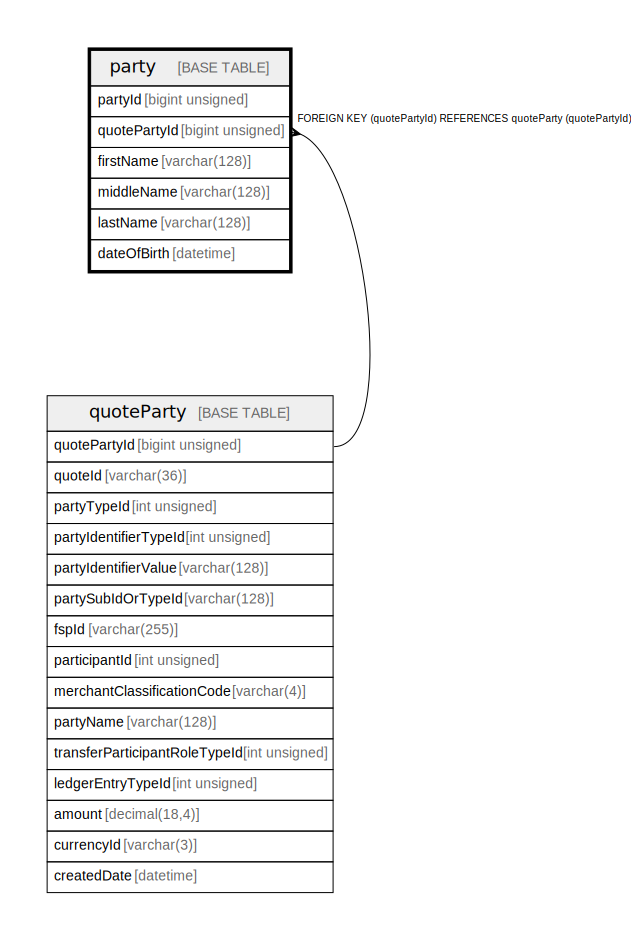

# party

## Description

Optional pers. data provided during Quote Request & Response

<details>
<summary><strong>Table Definition</strong></summary>

```sql
CREATE TABLE `party` (
  `partyId` bigint unsigned NOT NULL AUTO_INCREMENT,
  `quotePartyId` bigint unsigned NOT NULL,
  `firstName` varchar(128) COLLATE utf8mb4_unicode_ci DEFAULT NULL,
  `middleName` varchar(128) COLLATE utf8mb4_unicode_ci DEFAULT NULL,
  `lastName` varchar(128) COLLATE utf8mb4_unicode_ci DEFAULT NULL,
  `dateOfBirth` datetime DEFAULT NULL,
  PRIMARY KEY (`partyId`),
  KEY `party_quotepartyid_foreign` (`quotePartyId`),
  CONSTRAINT `party_quotepartyid_foreign` FOREIGN KEY (`quotePartyId`) REFERENCES `quoteParty` (`quotePartyId`)
) ENGINE=InnoDB DEFAULT CHARSET=utf8mb4 COLLATE=utf8mb4_unicode_ci COMMENT='Optional pers. data provided during Quote Request & Response'
```

</details>

## Columns

| Name | Type | Default | Nullable | Extra Definition | Children | Parents | Comment |
| ---- | ---- | ------- | -------- | ---------------- | -------- | ------- | ------- |
| partyId | bigint unsigned |  | false | auto_increment |  |  |  |
| quotePartyId | bigint unsigned |  | false |  |  | [quoteParty](quoteParty.md) |  |
| firstName | varchar(128) |  | true |  |  |  |  |
| middleName | varchar(128) |  | true |  |  |  |  |
| lastName | varchar(128) |  | true |  |  |  |  |
| dateOfBirth | datetime |  | true |  |  |  |  |

## Constraints

| Name | Type | Definition |
| ---- | ---- | ---------- |
| party_quotepartyid_foreign | FOREIGN KEY | FOREIGN KEY (quotePartyId) REFERENCES quoteParty (quotePartyId) |
| PRIMARY | PRIMARY KEY | PRIMARY KEY (partyId) |

## Indexes

| Name | Definition |
| ---- | ---------- |
| party_quotepartyid_foreign | KEY party_quotepartyid_foreign (quotePartyId) USING BTREE |
| PRIMARY | PRIMARY KEY (partyId) USING BTREE |

## Relations



---

> Generated by [tbls](https://github.com/k1LoW/tbls)
