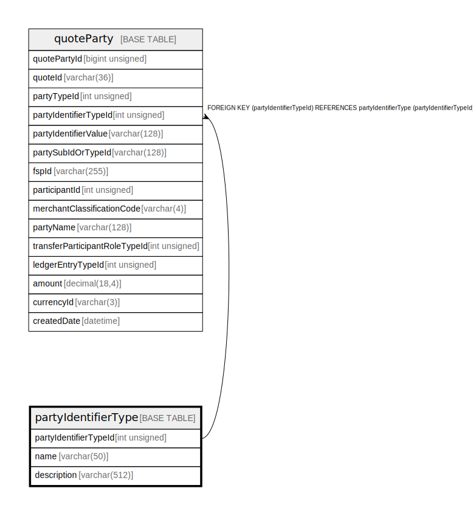

# partyIdentifierType

## Description

<details>
<summary><strong>Table Definition</strong></summary>

```sql
CREATE TABLE `partyIdentifierType` (
  `partyIdentifierTypeId` int unsigned NOT NULL AUTO_INCREMENT,
  `name` varchar(50) NOT NULL,
  `description` varchar(512) NOT NULL,
  PRIMARY KEY (`partyIdentifierTypeId`),
  UNIQUE KEY `partyidentifiertype_name_unique` (`name`)
) ENGINE=InnoDB AUTO_INCREMENT=[Redacted by tbls] DEFAULT CHARSET=utf8mb4 COLLATE=utf8mb4_0900_ai_ci
```

</details>

## Columns

| Name | Type | Default | Nullable | Extra Definition | Children | Parents | Comment |
| ---- | ---- | ------- | -------- | ---------------- | -------- | ------- | ------- |
| partyIdentifierTypeId | int unsigned |  | false | auto_increment | [quoteParty](quoteParty.md) |  |  |
| name | varchar(50) |  | false |  |  |  |  |
| description | varchar(512) |  | false |  |  |  |  |

## Constraints

| Name | Type | Definition |
| ---- | ---- | ---------- |
| partyidentifiertype_name_unique | UNIQUE | UNIQUE KEY partyidentifiertype_name_unique (name) |
| PRIMARY | PRIMARY KEY | PRIMARY KEY (partyIdentifierTypeId) |

## Indexes

| Name | Definition |
| ---- | ---------- |
| PRIMARY | PRIMARY KEY (partyIdentifierTypeId) USING BTREE |
| partyidentifiertype_name_unique | UNIQUE KEY partyidentifiertype_name_unique (name) USING BTREE |

## Relations



---

> Generated by [tbls](https://github.com/k1LoW/tbls)
