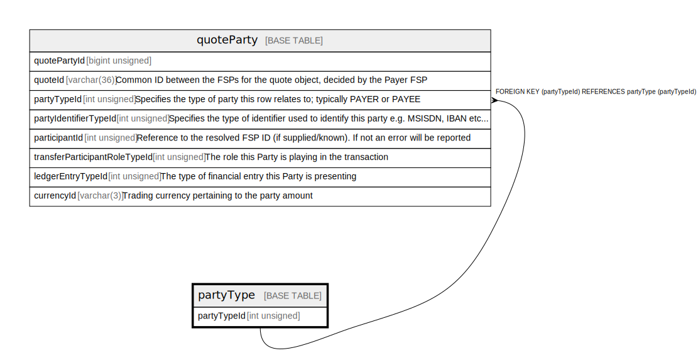

# partyType

## Description

<details>
<summary><strong>Table Definition</strong></summary>

```sql
CREATE TABLE `partyType` (
  `partyTypeId` int unsigned NOT NULL AUTO_INCREMENT,
  `name` varchar(128) NOT NULL,
  `description` varchar(256) NOT NULL,
  PRIMARY KEY (`partyTypeId`),
  UNIQUE KEY `partytype_name_unique` (`name`)
) ENGINE=InnoDB AUTO_INCREMENT=[Redacted by tbls] DEFAULT CHARSET=utf8mb4 COLLATE=utf8mb4_0900_ai_ci
```

</details>

## Columns

| Name        | Type         | Default | Nullable | Extra Definition | Children                    |
| ----------- | ------------ | ------- | -------- | ---------------- | --------------------------- |
| partyTypeId | int unsigned |         | false    | auto_increment   | [quoteParty](quoteParty.md) |
| name        | varchar(128) |         | false    |                  |                             |
| description | varchar(256) |         | false    |                  |                             |

## Constraints

| Name                  | Type        | Definition                              |
| --------------------- | ----------- | --------------------------------------- |
| partytype_name_unique | UNIQUE      | UNIQUE KEY partytype_name_unique (name) |
| PRIMARY               | PRIMARY KEY | PRIMARY KEY (partyTypeId)               |

## Indexes

| Name                  | Definition                                          |
| --------------------- | --------------------------------------------------- |
| PRIMARY               | PRIMARY KEY (partyTypeId) USING BTREE               |
| partytype_name_unique | UNIQUE KEY partytype_name_unique (name) USING BTREE |

## Relations



---

> Generated by [tbls](https://github.com/k1LoW/tbls)
