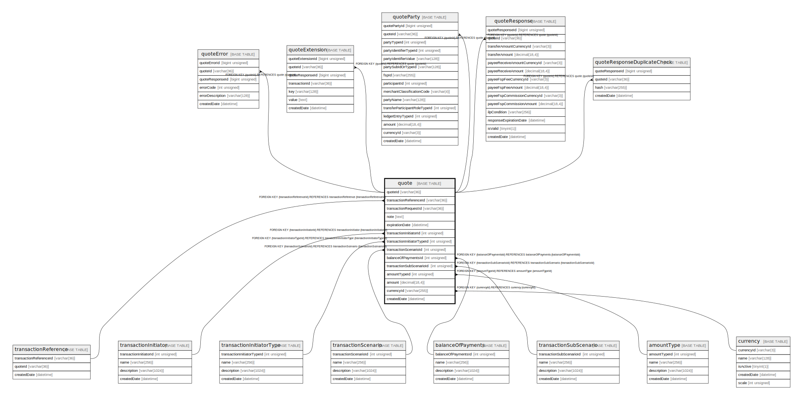

# quote

## Description

<details>
<summary><strong>Table Definition</strong></summary>

```sql
CREATE TABLE `quote` (
  `quoteId` varchar(36) NOT NULL,
  `transactionReferenceId` varchar(36) NOT NULL COMMENT 'Common ID (decided by the Payer FSP) between the FSPs for the future transaction object',
  `transactionRequestId` varchar(36) DEFAULT NULL COMMENT 'Optional previously-sent transaction request',
  `note` text COMMENT 'A memo that will be attached to the transaction',
  `expirationDate` datetime DEFAULT NULL COMMENT 'Optional expiration for the requested transaction',
  `transactionInitiatorId` int unsigned NOT NULL COMMENT 'This is part of the transaction initiator',
  `transactionInitiatorTypeId` int unsigned NOT NULL COMMENT 'This is part of the transaction initiator type',
  `transactionScenarioId` int unsigned NOT NULL COMMENT 'This is part of the transaction scenario',
  `balanceOfPaymentsId` int unsigned DEFAULT NULL COMMENT 'This is part of the transaction type that contains the elements- balance of payment',
  `transactionSubScenarioId` int unsigned DEFAULT NULL COMMENT 'This is part of the transaction type sub scenario as defined by the local scheme',
  `amountTypeId` int unsigned NOT NULL COMMENT 'This is part of the transaction type that contains valid elements for - Amount Type',
  `amount` decimal(18,4) NOT NULL DEFAULT '0.0000' COMMENT 'The amount that the quote is being requested for. Need to be interpert in accordance with the amount type',
  `currencyId` varchar(255) DEFAULT NULL COMMENT 'Trading currency pertaining to the Amount',
  `createdDate` datetime NOT NULL DEFAULT CURRENT_TIMESTAMP COMMENT 'System dateTime stamp pertaining to the inserted record',
  PRIMARY KEY (`quoteId`),
  KEY `quote_transactionreferenceid_foreign` (`transactionReferenceId`),
  KEY `quote_transactionrequestid_foreign` (`transactionRequestId`),
  KEY `quote_transactioninitiatorid_foreign` (`transactionInitiatorId`),
  KEY `quote_transactioninitiatortypeid_foreign` (`transactionInitiatorTypeId`),
  KEY `quote_transactionscenarioid_foreign` (`transactionScenarioId`),
  KEY `quote_balanceofpaymentsid_foreign` (`balanceOfPaymentsId`),
  KEY `quote_transactionsubscenarioid_foreign` (`transactionSubScenarioId`),
  KEY `quote_amounttypeid_foreign` (`amountTypeId`),
  KEY `quote_currencyid_foreign` (`currencyId`),
  CONSTRAINT `quote_amounttypeid_foreign` FOREIGN KEY (`amountTypeId`) REFERENCES `amountType` (`amountTypeId`),
  CONSTRAINT `quote_balanceofpaymentsid_foreign` FOREIGN KEY (`balanceOfPaymentsId`) REFERENCES `balanceOfPayments` (`balanceOfPaymentsId`),
  CONSTRAINT `quote_currencyid_foreign` FOREIGN KEY (`currencyId`) REFERENCES `currency` (`currencyId`),
  CONSTRAINT `quote_transactioninitiatorid_foreign` FOREIGN KEY (`transactionInitiatorId`) REFERENCES `transactionInitiator` (`transactionInitiatorId`),
  CONSTRAINT `quote_transactioninitiatortypeid_foreign` FOREIGN KEY (`transactionInitiatorTypeId`) REFERENCES `transactionInitiatorType` (`transactionInitiatorTypeId`),
  CONSTRAINT `quote_transactionreferenceid_foreign` FOREIGN KEY (`transactionReferenceId`) REFERENCES `transactionReference` (`transactionReferenceId`),
  CONSTRAINT `quote_transactionscenarioid_foreign` FOREIGN KEY (`transactionScenarioId`) REFERENCES `transactionScenario` (`transactionScenarioId`),
  CONSTRAINT `quote_transactionsubscenarioid_foreign` FOREIGN KEY (`transactionSubScenarioId`) REFERENCES `transactionSubScenario` (`transactionSubScenarioId`)
) ENGINE=InnoDB DEFAULT CHARSET=utf8mb4 COLLATE=utf8mb4_0900_ai_ci
```

</details>

## Columns

| Name | Type | Default | Nullable | Extra Definition | Children | Parents | Comment |
| ---- | ---- | ------- | -------- | ---------------- | -------- | ------- | ------- |
| quoteId | varchar(36) |  | false |  | [quoteError](quoteError.md) [quoteExtension](quoteExtension.md) [quoteParty](quoteParty.md) [quoteResponse](quoteResponse.md) [quoteResponseDuplicateCheck](quoteResponseDuplicateCheck.md) |  |  |
| transactionReferenceId | varchar(36) |  | false |  |  | [transactionReference](transactionReference.md) | Common ID (decided by the Payer FSP) between the FSPs for the future transaction object |
| transactionRequestId | varchar(36) |  | true |  |  |  | Optional previously-sent transaction request |
| note | text |  | true |  |  |  | A memo that will be attached to the transaction |
| expirationDate | datetime |  | true |  |  |  | Optional expiration for the requested transaction |
| transactionInitiatorId | int unsigned |  | false |  |  | [transactionInitiator](transactionInitiator.md) | This is part of the transaction initiator |
| transactionInitiatorTypeId | int unsigned |  | false |  |  | [transactionInitiatorType](transactionInitiatorType.md) | This is part of the transaction initiator type |
| transactionScenarioId | int unsigned |  | false |  |  | [transactionScenario](transactionScenario.md) | This is part of the transaction scenario |
| balanceOfPaymentsId | int unsigned |  | true |  |  | [balanceOfPayments](balanceOfPayments.md) | This is part of the transaction type that contains the elements- balance of payment |
| transactionSubScenarioId | int unsigned |  | true |  |  | [transactionSubScenario](transactionSubScenario.md) | This is part of the transaction type sub scenario as defined by the local scheme |
| amountTypeId | int unsigned |  | false |  |  | [amountType](amountType.md) | This is part of the transaction type that contains valid elements for - Amount Type |
| amount | decimal(18,4) | 0.0000 | false |  |  |  | The amount that the quote is being requested for. Need to be interpert in accordance with the amount type |
| currencyId | varchar(255) |  | true |  |  | [currency](currency.md) | Trading currency pertaining to the Amount |
| createdDate | datetime | CURRENT_TIMESTAMP | false | DEFAULT_GENERATED |  |  | System dateTime stamp pertaining to the inserted record |

## Constraints

| Name | Type | Definition |
| ---- | ---- | ---------- |
| PRIMARY | PRIMARY KEY | PRIMARY KEY (quoteId) |
| quote_amounttypeid_foreign | FOREIGN KEY | FOREIGN KEY (amountTypeId) REFERENCES amountType (amountTypeId) |
| quote_balanceofpaymentsid_foreign | FOREIGN KEY | FOREIGN KEY (balanceOfPaymentsId) REFERENCES balanceOfPayments (balanceOfPaymentsId) |
| quote_currencyid_foreign | FOREIGN KEY | FOREIGN KEY (currencyId) REFERENCES currency (currencyId) |
| quote_transactioninitiatorid_foreign | FOREIGN KEY | FOREIGN KEY (transactionInitiatorId) REFERENCES transactionInitiator (transactionInitiatorId) |
| quote_transactioninitiatortypeid_foreign | FOREIGN KEY | FOREIGN KEY (transactionInitiatorTypeId) REFERENCES transactionInitiatorType (transactionInitiatorTypeId) |
| quote_transactionreferenceid_foreign | FOREIGN KEY | FOREIGN KEY (transactionReferenceId) REFERENCES transactionReference (transactionReferenceId) |
| quote_transactionscenarioid_foreign | FOREIGN KEY | FOREIGN KEY (transactionScenarioId) REFERENCES transactionScenario (transactionScenarioId) |
| quote_transactionsubscenarioid_foreign | FOREIGN KEY | FOREIGN KEY (transactionSubScenarioId) REFERENCES transactionSubScenario (transactionSubScenarioId) |

## Indexes

| Name | Definition |
| ---- | ---------- |
| quote_amounttypeid_foreign | KEY quote_amounttypeid_foreign (amountTypeId) USING BTREE |
| quote_balanceofpaymentsid_foreign | KEY quote_balanceofpaymentsid_foreign (balanceOfPaymentsId) USING BTREE |
| quote_currencyid_foreign | KEY quote_currencyid_foreign (currencyId) USING BTREE |
| quote_transactioninitiatorid_foreign | KEY quote_transactioninitiatorid_foreign (transactionInitiatorId) USING BTREE |
| quote_transactioninitiatortypeid_foreign | KEY quote_transactioninitiatortypeid_foreign (transactionInitiatorTypeId) USING BTREE |
| quote_transactionreferenceid_foreign | KEY quote_transactionreferenceid_foreign (transactionReferenceId) USING BTREE |
| quote_transactionrequestid_foreign | KEY quote_transactionrequestid_foreign (transactionRequestId) USING BTREE |
| quote_transactionscenarioid_foreign | KEY quote_transactionscenarioid_foreign (transactionScenarioId) USING BTREE |
| quote_transactionsubscenarioid_foreign | KEY quote_transactionsubscenarioid_foreign (transactionSubScenarioId) USING BTREE |
| PRIMARY | PRIMARY KEY (quoteId) USING BTREE |

## Relations



---

> Generated by [tbls](https://github.com/k1LoW/tbls)
