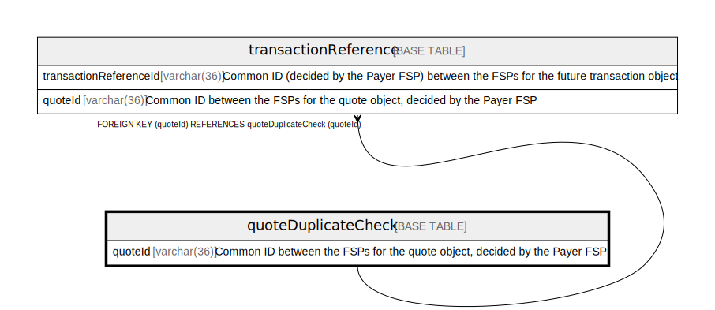

# quoteDuplicateCheck

## Description

<details>
<summary><strong>Table Definition</strong></summary>

```sql
CREATE TABLE `quoteDuplicateCheck` (
  `quoteId` varchar(36) NOT NULL COMMENT 'Common ID between the FSPs for the quote object, decided by the Payer FSP',
  `hash` varchar(1024) DEFAULT NULL COMMENT 'hash value received for the quote request',
  `createdDate` datetime NOT NULL DEFAULT CURRENT_TIMESTAMP COMMENT 'System dateTime stamp pertaining to the inserted record',
  PRIMARY KEY (`quoteId`)
) ENGINE=InnoDB DEFAULT CHARSET=utf8mb4 COLLATE=utf8mb4_0900_ai_ci
```

</details>

## Columns

| Name        | Type          | Default           | Nullable | Extra Definition  | Children                                        | Comment                                                                   |
| ----------- | ------------- | ----------------- | -------- | ----------------- | ----------------------------------------------- | ------------------------------------------------------------------------- |
| quoteId     | varchar(36)   |                   | false    |                   | [transactionReference](transactionReference.md) | Common ID between the FSPs for the quote object, decided by the Payer FSP |
| hash        | varchar(1024) |                   | true     |                   |                                                 | hash value received for the quote request                                 |
| createdDate | datetime      | CURRENT_TIMESTAMP | false    | DEFAULT_GENERATED |                                                 | System dateTime stamp pertaining to the inserted record                   |

## Constraints

| Name    | Type        | Definition            |
| ------- | ----------- | --------------------- |
| PRIMARY | PRIMARY KEY | PRIMARY KEY (quoteId) |

## Indexes

| Name    | Definition                        |
| ------- | --------------------------------- |
| PRIMARY | PRIMARY KEY (quoteId) USING BTREE |

## Relations



---

> Generated by [tbls](https://github.com/k1LoW/tbls)
